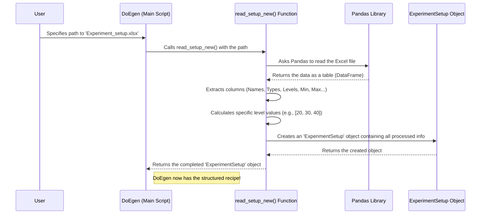

# Chapter 1: Experiment Setup Definition

Welcome to the `DoEgen` tutorial! Before we can start designing clever experiments, we first need to clearly tell `DoEgen` *what* we want to test. This chapter is all about defining the structure and ingredients of your experiment.

## What's the Big Idea? Planning Your Experiment Recipe

Imagine you want to bake the perfect cake. You wouldn't just randomly throw ingredients into a bowl! You'd start with a recipe that lists:
*   **Ingredients:** Flour, Sugar, Eggs, Temperature, Baking Time...
*   **Amounts/Settings:** 2 cups of Flour, 1 cup of Sugar, Bake at 180°C for 30 minutes...
*   **Types:** White Flour vs. Whole Wheat, Granulated Sugar vs. Brown Sugar...

Defining an **Experiment Setup** in `DoEgen` is exactly like creating this recipe list for your experiment. It tells `DoEgen` precisely:
*   What factors (variables or "ingredients") you want to change and study.
*   What different values or types (levels) each factor can have.
*   Whether a factor is a number (like temperature) or a category (like material type).

This definition is the absolute foundation for everything that follows. Without a clear setup, `DoEgen` can't generate an efficient plan for your experiments.

## Key Ingredients of an Experiment Setup

Let's break down the components you need to define:

1.  **Factors:** These are the variables you control and want to investigate in your experiment.
    *   *Analogy:* In our cake example, `Temperature`, `Sugar Amount`, and `Flour Type` are factors.
    *   *Example:* If studying plant growth, factors might be `Water Amount`, `Sunlight Hours`, `Fertilizer Type`.

2.  **Factor Types:** Factors can be different kinds:
    *   **Numeric:** Represented by numbers.
        *   **Continuous:** Can take any value within a range (e.g., Temperature: 20.5°C, 31.2°C, etc.).
        *   **Discrete:** Can only take specific numeric values, often whole numbers (e.g., Number of Seeds planted: 1, 2, 3).
    *   **Categorical:** Represented by distinct categories or labels, not numbers (e.g., Fertilizer Type: 'Brand A', 'Brand B', 'Organic').

3.  **Levels:** These are the specific values or settings you choose to test for each factor.
    *   *Analogy:* For the `Temperature` factor, you might test 3 levels: 170°C, 180°C, 190°C. For `Flour Type`, you might test 2 levels: 'White', 'Whole Wheat'.
    *   The **number of levels** tells `DoEgen` how many different settings you want to examine for that factor. More levels allow for more detailed analysis but usually require more experiments.

4.  **Ranges / Specific Values:** How you define the levels depends on the factor type:
    *   **Numeric:** You typically provide a `Minimum` and `Maximum` value. `DoEgen` then calculates evenly spaced levels based on the `Level Number` you specified. For example, if Temperature is Continuous, has 3 Levels, Min=20, Max=40, the levels might be 20, 30, 40.
    *   **Categorical:** You usually list the exact names of the categories (levels). For example, if Fertilizer Type has 2 levels, you might specify them as 'Brand A', 'Brand B'.

## The Experiment Setup Excel Template

The easiest way to give `DoEgen` this "recipe" is by filling out a simple Excel spreadsheet. `DoEgen` provides template files to get you started.

You can create a blank template by running a helper script included with `DoEgen`:

```bash
# Run this command in your terminal in the DoEgen project directory
python -m doegen.create_setupfile
# Or for an extended version with more options:
# python -m doegen.create_setupfile_extended
```

This creates an Excel file (like `Experiment_setup_template.xlsx`) with the necessary columns. Here's what the main columns mean:

| Column Header    | Description                                                                                                                               | Example           |
| :--------------- | :---------------------------------------------------------------------------------------------------------------------------------------- | :---------------- |
| `Parameter Name` | The name of your factor.                                                                                                                  | `Temperature`     |
| `Parameter Type` | The type of factor: `Continuous`, `Discrete`, or `Categorical`.                                                                           | `Continuous`      |
| `Level Number`   | How many different values/settings you want to test for this factor.                                                                      | `3`               |
| `Minimum`        | The lowest value for Numeric factors. (Leave blank for Categorical).                                                                      | `20`              |
| `Maximum`        | The highest value for Numeric factors. (Leave blank for Categorical).                                                                     | `40`              |
| `Levels` (Optional) | For Categorical factors, list the exact level names separated by commas. Can also be used for specific numeric levels. | `Brand A, Brand B` |
| `Include (Y/N)` (Optional) | Set to 'No' if you want to list a factor but *not* vary it in this specific design. Defaults to 'Yes'. | `Yes`             |

Here's how you might fill it out for a simple experiment:

*(Based on the image from `MANUAL.md`)*
{width=600}

**Example Fill-out:**

| Parameter Name | Parameter Type | Level Number | Minimum | Maximum | Levels                 |
| :------------- | :------------- | :----------- | :------ | :------ | :--------------------- |
| Temperature    | Continuous     | 3            | 20      | 40      |                        |
| Pressure       | Discrete       | 2            | 1       | 5       |                        |
| Catalyst       | Categorical    | 2            |         |         | Catalyst X, Catalyst Y |
| Speed          | Continuous     | 3            | 100     | 300     |                        |

This table clearly tells `DoEgen`:
*   We have 4 factors: Temperature, Pressure, Catalyst, Speed.
*   Temperature is continuous, tested at 3 levels between 20 and 40.
*   Pressure is discrete, tested at 2 levels between 1 and 5.
*   Catalyst is categorical, tested with 'Catalyst X' and 'Catalyst Y'.
*   Speed is continuous, tested at 3 levels between 100 and 300.

## How `DoEgen` Reads Your Recipe (Simplified View)

Under the hood, `DoEgen` uses Python code to read this Excel file and understand your experimental setup. It primarily uses the `pandas` library to handle the spreadsheet data.

Here's a very simplified Python snippet illustrating the core idea (the actual code in `doegen/doegen.py` within the `read_setup_new` function is more detailed):

```python
# Simplified view of how DoEgen reads the setup file (doegen/doegen.py)
import pandas as pd

def read_setup_simplified(fname_setup):
    """Reads the Excel setup file and extracts factor information."""
    try:
        # Use pandas library to read the Excel file into a table (DataFrame)
        df = pd.read_excel(fname_setup)
        print(f"Successfully read setup file: {fname_setup}")

        # --- Extract Basic Info ---
        # Get lists of names, types, levels, etc. from the table columns
        factor_names = df["Parameter Name"].tolist()
        level_numbers = df["Level Number"].tolist()
        # ... extract other columns like Parameter Type, Min, Max, Levels ...

        # --- Determine Specific Level Values (Simplified Logic) ---
        # (Actual code calculates numeric levels based on min/max/count
        # and parses categorical levels from the 'Levels' column)
        # level_values = calculate_actual_levels(df) # Placeholder

        print(f"Found {len(factor_names)} factors to include:")
        print(f"  Names: {factor_names}")
        print(f"  Levels per factor: {level_numbers}")

        # Store this information in a structured way (like the ExperimentalSetup object)
        # setup_object = create_setup_object(level_numbers, level_values, factor_names)
        # return setup_object # Return the processed setup info

    except FileNotFoundError:
        print(f"Error: Setup file not found at {fname_setup}")
    except Exception as e:
        print(f"Error reading setup file: {e}")

# Example of how DoEgen might use this function internally:
# experiment_setup = read_setup_simplified("Experiment_setup_template.xlsx")
# if experiment_setup:
#    # Now use experiment_setup for Design Generation...
#    pass
```

This code essentially:
1.  Opens and reads the Excel file specified.
2.  Pulls out the information from each column (Parameter Name, Level Number, etc.).
3.  Processes this raw information to figure out the exact level values for each factor (e.g., calculating `[20, 30, 40]` for Temperature).
4.  Packages this structured information neatly so other parts of `DoEgen` can use it.

## The Process Flow

Here's a simple diagram showing how your Excel file becomes the setup definition inside `DoEgen`:



## Conclusion

In this chapter, we learned the fundamental concept of the **Experiment Setup Definition**. It's the crucial first step where you precisely define the "ingredients" (factors), their "types" (numeric/categorical), and the specific "settings" (levels) you want to test in your experiment. We saw how to provide this information using a structured Excel template.

This setup definition acts as the blueprint or recipe that `DoEgen` needs. With this information clearly defined, we are now ready to move on to the next exciting step: actually creating the experimental plan.

Let's dive into [Chapter 2: Design Generation
](02_design_generation_.md) to see how `DoEgen` uses this setup to build an efficient experiment schedule!

---

Generated by [AI Codebase Knowledge Builder](https://github.com/The-Pocket/Tutorial-Codebase-Knowledge)