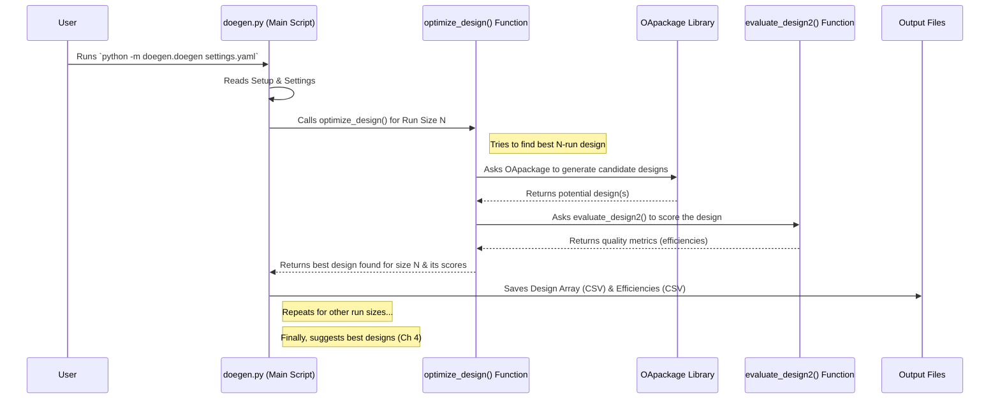

# Chapter 2: Design Generation

In [Chapter 1: Experiment Setup Definition
](01_experiment_setup_definition_.md), we learned how to create the "recipe" for our experiment by defining the factors, levels, and types. Now that `DoEgen` knows *what* we want to test, this chapter focuses on *how* to plan the actual sequence of experiments efficiently. This core process is called **Design Generation**.

## The Challenge: Too Many Experiments!

Imagine you want to test different settings for baking that perfect cake from Chapter 1. Let's say you have:
*   Temperature: 3 levels (170°C, 180°C, 190°C)
*   Sugar Amount: 3 levels (0.8 cup, 1 cup, 1.2 cups)
*   Flour Type: 2 levels (White, Whole Wheat)
*   Baking Time: 3 levels (25 min, 30 min, 35 min)

If you wanted to test *every single possible combination* (a "full factorial" design), you'd need to bake:
`3 (Temp) * 3 (Sugar) * 2 (Flour) * 3 (Time) = 54` cakes!

That's a lot of baking! For more complex experiments with more factors or levels, the number of combinations explodes quickly. This is where **Design Generation** comes in.

## The Solution: A Smart Scheduler for Experiments

**Design Generation** in `DoEgen` is like using a **smart scheduler** to plan your experiments. Instead of running every single combination, it intelligently selects a much smaller, representative set of runs.

Think about test-driving cars. You want to evaluate different features (engine type, transmission, color, trim level). You *could* test drive every single possible configuration, but that would take forever! A smart scheduler would help you pick the minimum number of diverse test drives needed to get a good feel for all the important features and how they might interact, without driving hundreds of cars.

`DoEgen` aims to create designs (experimental plans) that are:
1.  **Efficient:** Uses the minimum number of runs possible to get meaningful results.
2.  **Balanced:** Tests each level of each factor roughly the same number of times. (Like making sure you test both 'White' and 'Whole Wheat' flour fairly).
3.  **Near-Orthogonal:** Tries to ensure factors can be evaluated independently. (Ideally, changing the 'Temperature' shouldn't automatically force a change in 'Baking Time' in your plan).

To achieve this, `DoEgen` cleverly uses the `OApackage` library, which specializes in finding these kinds of optimized experimental plans, often based on mathematical structures called Orthogonal Arrays.

## How to Generate a Design with `DoEgen`

Generating a design involves two main things:
1.  Your **Experiment Setup file** (the Excel file we created in Chapter 1).
2.  A **Settings file** (usually `settings_design.yaml`) that tells `DoEgen` things like:
    *   Where to find your setup file.
    *   How many experimental runs you're willing to do (e.g., a minimum and maximum number).
    *   Where to save the generated designs.
    *   How much computer time to spend searching for the best design. (We'll cover settings files in detail in [Chapter 8: Configuration Handling
        ](08_configuration_handling_.md)).

Once you have these ready, you run `DoEgen` from your terminal:

```bash
# Make sure your setup file (e.g., Experiment_setup.xlsx) is ready
# Make sure your settings file (e.g., settings_design.yaml) is configured

# Run the design generation module
python -m doegen.doegen settings_design.yaml
```

**What does this command do?**
*   It tells Python to run the `doegen` module within the `doegen` package.
*   It passes the `settings_design.yaml` file as input, which tells `DoEgen` all the specifics for this run.

**What happens next?**
`DoEgen` will:
1.  Read your setup file (`Experiment_setup.xlsx`).
2.  Read your settings file (`settings_design.yaml`).
3.  Figure out the range of run numbers to explore (e.g., from 12 runs up to 150 runs, in steps of 6, based on your settings).
4.  For *each* run number in that range, it will use `OApackage` to search for an optimized design (a sequence of experiments). This can take some time, especially for larger designs.
5.  It saves each generated design as a simple table (CSV file).
6.  It also calculates some quality scores (efficiencies) for each design and saves those too. (More on this in [Chapter 3: Design Evaluation & Efficiency Metrics
    ](03_design_evaluation___efficiency_metrics_.md)).

**Example Output (Simplified Design Array):**

After running, `DoEgen` might create files like `EDarray_[3, 3, 2, 3]_Nrun54.csv` in an output folder. This file contains the actual plan. It looks like a table where each row is one experiment run, and each column is a factor:

```csv
# Simplified Example: EDarray_..._Nrun12.csv (A design with 12 runs)
# Note: Actual arrays use numbers (0, 1, 2...) to represent levels internally.
# DoEgen later converts these back to your actual values (e.g., 170C, 180C).

# Factor Levels: Temp(3), Sugar(3), Flour(2), Time(3)
# Levels represented as 0, 1, 2...

0,0,0,0  # Run 1: Temp=Level 0, Sugar=Level 0, Flour=Level 0, Time=Level 0
1,1,0,1  # Run 2: Temp=Level 1, Sugar=Level 1, Flour=Level 0, Time=Level 1
2,2,0,2  # Run 3: Temp=Level 2, Sugar=Level 2, Flour=Level 0, Time=Level 2
0,1,1,2  # Run 4: Temp=Level 0, Sugar=Level 1, Flour=Level 1, Time=Level 2
1,2,1,0  # Run 5: Temp=Level 1, Sugar=Level 2, Flour=Level 1, Time=Level 0
2,0,1,1  # Run 6: Temp=Level 2, Sugar=Level 0, Flour=Level 1, Time=Level 1
0,2,0,1  # Run 7: ... and so on ...
1,0,0,2
2,1,0,0
0,0,1,0
1,1,1,1
2,2,1,2
```

This table is the core output – your optimized schedule of experiments!

## What's Happening Under the Hood?

Let's peek inside `DoEgen` to see the main steps when you run the design generation command:

1.  **Read Inputs:** `DoEgen` first reads your experiment recipe from the Excel setup file ([Chapter 1: Experiment Setup Definition
    ](01_experiment_setup_definition_.md)) and the run parameters from the `settings_design.yaml` file ([Chapter 8: Configuration Handling
    ](08_configuration_handling_.md)).
2.  **Determine Run Sizes:** It calculates the range of experiment sizes (number of runs) to investigate, based on your settings (e.g., minimum runs, maximum runs, step size).
3.  **Optimize for Each Size:** For each number of runs (e.g., 12 runs, 18 runs, 24 runs...), it calls the core optimization function.
    *   This function (`optimize_design`) uses the `OApackage` library. `OApackage` is the "engine" that searches for balanced, near-orthogonal designs with the specified number of runs and factor levels. It tries many possibilities and selects the best ones it finds within the allowed time.
4.  **Evaluate Design Quality:** After `OApackage` proposes a design, `DoEgen` calculates various quality metrics (like balance, orthogonality, D-efficiency) using its `evaluate_design2` function. We'll learn about these metrics in [Chapter 3: Design Evaluation & Efficiency Metrics
    ](03_design_evaluation___efficiency_metrics_.md).
5.  **Save Results:** The best design found for that specific run size (e.g., the best 12-run design) and its associated quality scores are saved to files.
6.  **Repeat:** Steps 3-5 are repeated for all the different run sizes you asked `DoEgen` to explore.
7.  **Select & Summarize:** Finally, `DoEgen` analyzes the quality scores across all generated designs and suggests a few "good" options (minimum, optimal, best) based on predefined criteria. This is covered in [Chapter 4: Design Selection
    ](04_design_selection_.md).

Here's a simplified view of the process:



## Diving Deeper into the Code (Simplified View)

The main script `doegen/doegen.py` orchestrates this process.

1.  **Reading Setup:** It uses functions like `read_setup_new` (which we saw in Chapter 1) to load your experiment definition.

2.  **Looping and Optimizing:** The `main` function sets up a loop (or uses multiprocessing via `optimize_design_multi`) to iterate through the desired run sizes (e.g., `nrun_min` to `nrun_max` in steps of `ndelta`). Inside this loop, it calls `optimize_design` for each run size.

   ```python
   # Simplified view from doegen/doegen.py - main function logic

   def main(fname_setup, outpath, nrun_max, maxtime_per_run, delta_nrun, nrun_min):
       # 1. Read the experiment setup
       setup = ExperimentalSetup.read(fname_setup)
       print(f"Read setup for {setup.number_of_factors} factors.")

       # 2. Determine the range of run sizes to test
       # (Calculates nrun_min if not given, determines step size ndelta)
       ndelta = delta_nrun # Simplified
       # ... calculation of actual nrun_min ...
       xrun = np.arange(nrun_min, nrun_max, ndelta) # e.g., [12, 18, 24, ...]
       print(f"Will generate designs for run sizes: {xrun}")

       # 3. Optimize for each run size (potentially in parallel)
       all_efficiencies = []
       for runsize in xrun:
           print(f"--- Optimizing for {runsize} runs ---")
           # Call the core optimization function
           effs = optimize_design(setup, outpath, maxtime_per_run, ndelta, runsize)
           all_efficiencies.append(effs)
           # (Actual code might use optimize_design_multi for parallelism)

       # 4. Process results, save summary, suggest designs (See Ch 3 & 4)
       # ... save combined efficiencies ...
       # ... select minimum, optimal, best designs ...
       print("FINISHED Design Generation")
   ```

3.  **Core Optimization (`optimize_design`):** This function is the heart of the generation process. It prepares the inputs for `OApackage` and calls its optimization routine.

   ```python
   # Simplified view from doegen/doegen.py - optimize_design function

   import oapackage # The core library for finding designs

   def optimize_design(setup, outpath, runtime, delta, runsize, printopt=True):
       """Optimizes design for a specific runsize."""
       print(f"Searching for best design with {runsize} runs...")
       outpath_nrun = os.path.join(outpath, f"DesignArray_Nrun{runsize}/")

       # Define the problem for OApackage
       arrayclass = oapackage.arraydata_t(
           setup.factor_levels, runsize, 0, setup.number_of_factors
       )

       # Ask OApackage to find good designs (this is the complex part!)
       # It tries many random starts and improvements.
       # 'alpha' weights different optimization criteria.
       alpha = [5, 5, 15] # Example weights
       # 'niter' relates to how long it searches (calculated based on 'runtime')
       niter = calculate_iterations_based_on_time(runtime) # Simplified placeholder

       scores, _, designs, _ = oapackage.Doptim.Doptimize(
           arrayclass, nrestarts=10, niter=niter, optimfunc=alpha, maxtime=runtime
       )
       print(f"OApackage generated {len(designs)} candidate designs.")

       # Select the best design found by OApackage based on DoEgen's criteria
       # (Uses evaluate_design2 to score them - see Ch 3)
       best_design_array = find_best_among_candidates(setup, designs) # Simplified

       # Evaluate the final selected design
       efficiencies = evaluate_design2(setup, best_design_array, dir_out=outpath_nrun)

       # Save the best design array and its efficiencies
       save_design_and_efficiencies(outpath_nrun, setup, runsize, best_design_array, efficiencies)

       return efficiencies # Return the scores for this runsize
   ```

This simplified code shows how `DoEgen` acts as a manager: it sets up the problem, calls the specialized `OApackage` engine to do the heavy lifting of finding candidate designs, evaluates the results using its own criteria ([Chapter 3: Design Evaluation & Efficiency Metrics
](03_design_evaluation___efficiency_metrics_.md)), and saves the final plan.

## Conclusion

In this chapter, we explored **Design Generation**, the core process where `DoEgen` creates an efficient experimental plan. We learned that instead of testing every single combination (which is often impractical), `DoEgen` acts like a "smart scheduler", using the `OApackage` library to find a smaller set of experiments that are **balanced** and **near-orthogonal**.

We saw how to initiate this process using the `python -m doegen.doegen` command with a settings file, and what kind of output files (the design arrays) to expect. We also got a glimpse into the internal steps `DoEgen` takes to optimize and evaluate these designs.

Now that we have generated potential experimental plans, the next crucial step is to understand how "good" these plans actually are. Let's move on to [Chapter 3: Design Evaluation & Efficiency Metrics
](03_design_evaluation___efficiency_metrics_.md) to learn how `DoEgen` measures the quality of the generated designs.

---

Generated by [AI Codebase Knowledge Builder](https://github.com/The-Pocket/Tutorial-Codebase-Knowledge)