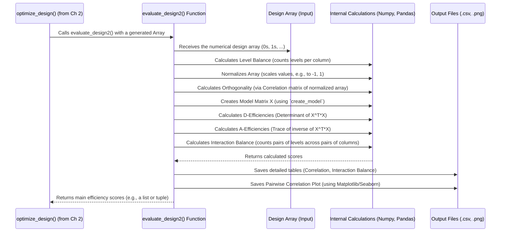

# Chapter 3: Design Evaluation & Efficiency Metrics

In [Chapter 2: Design Generation](02_design_generation_.md), we saw how `DoEgen` acts like a smart scheduler to create potential experimental plans (designs) for different numbers of runs. But how do we know if a generated plan is actually *good*? Just because we have a schedule doesn't mean it's efficient or useful. This chapter explains how `DoEgen` grades these plans using **Design Evaluation & Efficiency Metrics**.

## Why Grade Our Experiment Plan?

Imagine you created several potential test drive schedules (from Chapter 2) for evaluating new cars. Some schedules might have you driving only on highways, others only in the city. Some might make you test the red car way more often than the blue car. Clearly, not all schedules are equally helpful!

We need a way to **grade** these schedules based on specific criteria:
*   Does it test all the features (factors) fairly?
*   Does it cover different driving conditions (levels) evenly?
*   Does it avoid redundant tests or confusing situations where changing one feature always changes another?

**Design Evaluation** in `DoEgen` does exactly this for our experimental plans. It assigns numerical scores (metrics) to quantify how well-designed a plan is. This helps us compare different plans (e.g., a 12-run plan vs. an 18-run plan) and choose the one that gives us the most reliable information for the number of experiments we can afford.

## Key Grading Criteria: The Efficiency Metrics

`DoEgen` uses several statistical metrics to "grade" a design. Think of these like different subjects on a report card for your experimental plan. The scores usually range from 0 (worst) to 100 (best or theoretically optimal). Here are the main ones:

1.  **Level Balance:**
    *   **Question:** How evenly does the plan use each setting (level) for every factor?
    *   **Analogy:** In our cake baking plan, does it use 170°C, 180°C, and 190°C roughly the same number of times? Does it test 'White' flour about as often as 'Whole Wheat'?
    *   **Why it matters:** Ensures fair comparison of all levels. A low score means some settings are under-represented.
    *   **Score:** 0-100. 100 means perfect balance (each level appears exactly the same number of times, or as close as possible).

2.  **Orthogonality:**
    *   **Question:** How independent are the factors in the plan? Can we change one factor's setting without being forced to change another?
    *   **Analogy:** In the test drive schedule, if every time we test the 'Sport' engine, we *also* have to test the 'Manual' transmission, it's hard to tell if good performance is due to the engine or the transmission. An orthogonal plan avoids this forced pairing.
    *   **Why it matters:** Allows us to estimate the effect of each factor separately without confusion. Low orthogonality (high correlation between factor columns in the plan) makes analysis difficult.
    *   **Score:** 0-100. 100 means perfectly orthogonal (all factors are statistically independent in the design).

3.  **D-Efficiency (D1-Eff, D-Eff, D2-Eff):**
    *   **Question:** How precisely can we estimate the effects of the factors based on this plan?
    *   **Analogy:** Think of this as the "sharpness" or "focus" of the picture we'll get about how each factor influences the outcome. A higher D-efficiency means a sharper picture.
    *   **Why it matters:** A more D-efficient design allows for more accurate conclusions about which factors are important and by how much.
    *   **Details:**
        *   `D1-Eff`: Considers only the main effects of each factor (most commonly used for initial screening).
        *   `D-Eff`: Considers main effects *and* quadratic effects (e.g., effect of Temperature and Temperature-squared).
        *   `D2-Eff`: Considers main, quadratic, *and* two-way interaction effects (e.g., how Temperature and Sugar Amount interact).
    *   **Score:** 0-100. 100 is a theoretical maximum. Higher is better, especially for `D1-Eff` in smaller designs.

4.  **Interaction Balance (Two-way Interaction Balance):**
    *   **Question:** How evenly does the plan test combinations of *pairs* of factor levels?
    *   **Analogy:** Does our cake plan test 'White' flour combined with 170°C, 180°C, and 190°C? Does it also test 'Whole Wheat' flour with all three temperatures? Does it do this fairly for *all pairs* of factors?
    *   **Why it matters:** Helps understand if the effect of one factor changes depending on the level of another factor (interactions).
    *   **Score:** 0-100. 100 means all pairs of levels across all pairs of factors are tested equally often (or as close as possible).
    *   **Related Metric:** *Two-way Interaction with at least one occurrence*: Checks if *every* possible pair combination appears at least once. Score 100 means yes, lower means some combinations are missing entirely.

`DoEgen` also calculates other metrics like **Center Balance** (related to how well centered the design is for numeric factors) and **A-Efficiencies** (another measure related to estimation precision), giving a comprehensive evaluation.

## How `DoEgen` Performs the Evaluation

The good news is: you don't usually need to run a separate command for evaluation! When you run the [Design Generation](02_design_generation_.md) process (`python -m doegen.doegen settings_design.yaml`), `DoEgen` automatically evaluates *every* design it generates for each run size.

Inside `DoEgen`, a function called `evaluate_design2` (located in the `doegen/doegen.py` file) takes the generated design array (the table of 0s, 1s, 2s...) and calculates all these efficiency scores.

## Understanding the Evaluation Results

After running the design generation, `DoEgen` saves the results of the evaluation in a few places within your output directory (specified in `settings_design.yaml`):

1.  **Individual Efficiency Files:** For each run size (e.g., 12 runs), inside its specific subfolder (e.g., `DesignArray_Nrun12/`), you'll find:
    *   `Efficiencies_[factor_levels]_Nrun12.csv`: A file containing the calculated scores (Level Balance, Orthogonality, D1-Eff, etc.) for the best 12-run design found.
    *   `Table_Pearson_Correlation.csv`: Shows the pairwise correlation between factors (related to Orthogonality). Low values (near 0) are good.
    *   `Table_Interaction_Balance.txt`: Details about the balance of pairwise combinations.
    *   `pairwise_correlation.png`: A plot visualizing the relationships and balance within the design (see image below).

2.  **Combined Efficiency File:** In the main output directory, you'll find:
    *   `Efficiencies_[factor_levels]_all3.csv`: A summary table listing the key efficiency scores for *all* the run sizes tested (e.g., 12, 18, 24...). This is very useful for comparing designs.

    *Example Snippet (`Efficiencies_..._all3.csv`):*
    ```csv
    Center Balance,Level Balance,Orthogonality,Two-level Balance,Two-level Min-Eff,D-Eff,D1-Eff,D2-Eff,A-Eff,A1-Eff,A2-Eff,Nexp
    96.5,97.2,91.3,88.5,95.0,15.1,75.3,8.2,10.5,60.1,5.1,12
    98.1,98.5,94.6,92.1,100.0,18.9,85.7,10.1,12.8,72.5,6.8,18
    99.2,99.0,97.8,96.3,100.0,25.6,92.1,14.5,18.3,81.0,9.9,24
    ... (more rows for other run sizes) ...
    ```
    *This table lets you see how scores improve (or plateau) as you increase the number of experiments (`Nexp`).*

3.  **Efficiency Plot:** Also in the main output directory:
    *   `Efficiencies_[factor_levels].png`: A plot showing how key efficiencies change with the number of runs.

    {width=400}

    *   **How to read the plot:** The X-axis is the number of experiments (runs). The Y-axis is the efficiency score (0-100). Each colored line represents a different metric. You generally want designs where the lines for key metrics (like Level Balance, Orthogonality, Two-level Min-Eff, D1-Eff) are high (close to 100). This plot helps visualize the trade-off: often, scores improve rapidly at first and then level off. You might choose a run size where the scores are acceptably high but before the lines become flat (diminishing returns).

4.  **Pairwise Correlation Plot:** For each individual design (e.g., in `DesignArray_Nrun12/`):
    *   `pairwise_correlation.png`: Shows scatter plots for each pair of factors in the design.

    {width=600}

    *   **How to read the plot:**
        *   **Diagonal:** Histograms showing how often each level was used for that factor. Flat histograms indicate good Level Balance.
        *   **Off-Diagonal:** Scatter plots showing the combinations tested for pairs of factors. If the points fill the space somewhat evenly and the regression line (blue line) is mostly flat (horizontal), it indicates good Orthogonality between those two factors. Steep lines indicate correlation (bad for orthogonality).

## What's Happening Inside `evaluate_design2`?

Let's peek under the hood to see the basic steps the `evaluate_design2` function takes when it receives a design array:



**Simplified Code View (`doegen/doegen.py`):**

The `evaluate_design2` function uses libraries like `numpy` and `pandas` to perform these calculations. Here are highly simplified examples of the logic:

```python
# Simplified view inside doegen/doegen.py - evaluate_design2 function

import numpy as np
import pandas as pd
# ... other imports like itertools, matplotlib, seaborn ...

def normalize_array(Array):
    """Scales array columns, e.g., from 0,1,2 to -1, 0, 1."""
    # Simplified: Actual code handles different ranges properly
    colmax = np.max(Array, axis=0)
    colmin = np.min(Array, axis=0)
    # Avoid division by zero if a factor has only one level tested
    coldelta = np.where(colmax > colmin, colmax - colmin, 1)
    colmean = (colmax + colmin) / 2.0
    return 2 * (Array - colmean) / coldelta

def calc_Deff(X):
    """Calculates D-efficiency from model matrix X."""
    # D-eff relates to the determinant of the 'information matrix' (X^T * X)
    XX = np.dot(X.T, X)
    try:
        # Use slogdet for numerical stability
        _sign, logdet = np.linalg.slogdet(XX)
        # Geometric mean of eigenvalues, scaled
        det = np.exp(logdet / X.shape[1]) if _sign > 0 else 0
    except np.linalg.LinAlgError:
        det = 0 # Matrix might be singular (bad design)
    return 100 * det / X.shape[0] # Scaled score 0-100

# def create_model(Array, mode=1): ... # Creates model matrix (see Ch 2)

def evaluate_design2(setup, Array, printopt=False, dir_out=None, plotgrid=True):
    """Calculates various efficiency metrics for a design Array."""
    runsize, number_of_factors = Array.shape
    fac_levels = setup.factor_levels # e.g., [3, 3, 2, 3]

    # --- Level Balance Calculation (Simplified) ---
    sum_imbalance = 0.0
    for col_idx, nlevel in enumerate(fac_levels):
        column = Array[:, col_idx].astype(int)
        ideal_count_per_level = runsize / nlevel
        counts = np.bincount(column, minlength=nlevel) # Count occurrences of 0, 1, ...
        imbalance = np.sum(np.abs(counts - ideal_count_per_level))
        sum_imbalance += imbalance
    # Scale imbalance relative to total size, convert to % efficiency
    leveleff = 100 * (1 - sum_imbalance / (2 * (runsize - runsize / np.mean(fac_levels)))) # Formula nuance

    # --- Orthogonality (via Pearson Correlation) ---
    Anorm = normalize_array(Array) # Scale to -1 to 1 for fair correlation
    Acor_pearson = np.corrcoef(Anorm.T) # Calculate correlation matrix
    # Orthogonality relates to how close correlations are to zero
    # A simple (though not exact) proxy could involve off-diagonal sums
    ortho_measure = np.sum(np.abs(np.triu(Acor_pearson, k=1))) # Sum absolute off-diagonal correlations
    # Convert to 0-100 scale (lower correlation sum is better)
    orthoeff = 100 * (1 - ortho_measure / (number_of_factors * (number_of_factors - 1) / 2)) # Simplified scaling

    # --- D-Efficiency (Example for Main Effects D1-Eff) ---
    X1, _ = create_model(Anorm, mode=1, norm=False) # Model with main effects
    D1eff = calc_Deff(X1)

    # --- Interaction Balance (Conceptual) ---
    # Uses calc_twofactorbalance() internally
    # Involves iterating through pairs of columns (factors)
    # For each pair, count occurrences of level combinations (e.g., how often Factor A=0 and Factor B=1 occurs)
    # Compare counts to the ideal count (runsize / (levels_A * levels_B))
    # Sum up deviations to get imbalance score, convert to % efficiency
    twoleveleff, twolevelmin, _ = calc_twofactorbalance(setup, Array)
    twoleveleff, twolevelmin = 100 * twoleveleff, 100 * twolevelmin

    # ... calculate other metrics (Center Balance, A-Eff, D-Eff, D2-Eff) ...

    # --- Save outputs if dir_out is provided ---
    if dir_out is not None:
        # Save correlation tables, interaction balance tables, plots...
        # (Code uses pandas DataFrames .to_csv() and matplotlib/seaborn .savefig())
        pass

    # --- Return the main scores ---
    efficiencies = (
        # centereff, # Calculated earlier
        leveleff,
        orthoeff,
        twoleveleff,
        twolevelmin,
        # Deff, D1eff, D2eff, # Calculated
        # Aeff, A1eff, A2eff, # Calculated
        # ... other scores ...
    ) # Actual function returns a specific tuple of ~11 scores
    # Simplified return for clarity:
    return (leveleff, orthoeff, D1eff, twoleveleff, twolevelmin) # Example subset
```

This code takes the design array, performs calculations (like counting, normalizing, computing correlations, building models, finding determinants), saves detailed diagnostics, and finally returns the key efficiency scores.

## Conclusion

In this chapter, we learned about **Design Evaluation & Efficiency Metrics**. We saw that `DoEgen` doesn't just generate experiment plans; it also grades them using metrics like **Level Balance**, **Orthogonality**, **D-Efficiency**, and **Interaction Balance**. These scores, typically ranging from 0 to 100, tell us how "good" a design is in terms of fairness, independence, precision, and coverage of combinations.

We learned that this evaluation happens automatically during the [Design Generation](02_design_generation_.md) step, producing `.csv` files and plots that summarize the efficiencies for different run sizes. Understanding these metrics and plots is crucial for making an informed decision about which experimental plan to actually use.

Now that we know how to generate designs (Chapter 2) and how to evaluate their quality (Chapter 3), the next logical step is to use these evaluations to pick the best design for our specific needs and budget. Let's move on to [Chapter 4: Design Selection](04_design_selection_.md) to see how `DoEgen` helps us with this final step in planning our experiment.

---

Generated by [AI Codebase Knowledge Builder](https://github.com/The-Pocket/Tutorial-Codebase-Knowledge)