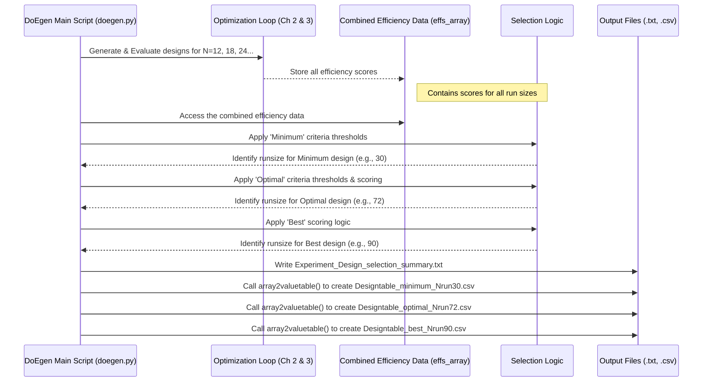

# Chapter 4: Design Selection

In the previous chapter, [Chapter 3: Design Evaluation & Efficiency Metrics](03_design_evaluation___efficiency_metrics_.md), we learned how `DoEgen` grades the experimental plans (designs) it creates using scores like Level Balance, Orthogonality, and D-Efficiency. We generated and evaluated designs for various numbers of experimental runs (e.g., 12 runs, 18 runs, 24 runs, etc.).

But now we have a bunch of potential plans, each with its own report card (efficiency scores). How do we pick the *right* one to actually use for our experiment? This is where **Design Selection** comes in!

## The Challenge: Choosing the Best Plan for You

Imagine you're planning a trip. A travel agent (like `DoEgen`'s design generation) might show you several itineraries:
*   A quick, bare-bones trip (fewest days, covers just the essentials).
*   A well-rounded trip (moderate length, good mix of sights and relaxation).
*   A long, comprehensive trip (many days, sees absolutely everything).

You wouldn't just pick one randomly! You'd consider your budget, how much time you have, and what's most important to you.

Similarly, after `DoEgen` generates and evaluates designs with different numbers of runs (12, 18, 24...), we need to choose the one that best fits our experimental "budget" (how many runs we can afford) and our "goals" (how much detail and reliability we need). Doing this manually by comparing all the efficiency scores for all the run sizes can be tedious.

## The Solution: Automatic Recommendations

`DoEgen` makes this easier by automatically suggesting a few good candidate designs based on the efficiency scores it calculated in Chapter 3. Think of it like the **travel agent highlighting three recommended options**:

1.  **Minimum Design:** This is like the **cheapest valid plan**. It's the design with the *fewest* experimental runs that still meets some basic quality standards (e.g., good enough balance and orthogonality, covers essential combinations). It's suitable if you're on a very tight budget or just doing an initial screening.

2.  **Optimal Design:** This is like the **best value-for-money plan**. It aims to find a sweet spot, balancing high quality (good efficiency scores) with a reasonable number of runs. It often requires more runs than the minimum, but the improvement in quality is usually worth the extra effort.

3.  **Best Design:** This is like the **most comprehensive plan**. It's the design that achieves the highest overall quality score among all the generated options, even if it means doing quite a few more experiments. This is for situations where getting the absolute highest quality data is the top priority, and the number of runs is less of a constraint.

This automatic selection process helps you quickly narrow down the choices to a few sensible options.

## How `DoEgen` Selects the Designs

Good news! Design selection happens **automatically** at the very end of the [Design Generation](02_design_generation_.md) process. When you run:

```bash
python -m doegen.doegen settings_design.yaml
```

After generating and evaluating designs for all requested run sizes (e.g., 12, 18, 24...), `DoEgen` performs one final step: it analyzes the collected efficiency data (specifically, the information stored in the `Efficiencies_[factor_levels]_all3.csv` file we saw in Chapter 3) and applies a set of rules to pick the Minimum, Optimal, and Best designs.

## The Selection Rules (Simplified View)

`DoEgen` uses specific thresholds based on the efficiency metrics from Chapter 3. Here's a simplified idea of the rules (the exact percentages can be found in the `DoEgen` documentation, like `MANUAL.md` or `README.md`):

1.  **Minimum Design Criteria:**
    *   **Goal:** Find the *smallest* design that's basically sound.
    *   **Rules:**
        *   Must have enough runs (usually, number of runs `Nexp >= number of factors + 1`).
        *   Must have good **Level Balance** (e.g., > 95%).
        *   Must have good **Orthogonality** (e.g., > 90%).
        *   Must test every pair of factor levels at least once (**Two-level Min-Eff** = 100%).
    *   `DoEgen` looks through the evaluated designs, starting from the smallest run size, and picks the *first one* that meets all these conditions.

2.  **Optimal Design Criteria:**
    *   **Goal:** Find the best balance between quality and run count among designs meeting stricter criteria.
    *   **Rules:**
        *   Must meet even *higher* thresholds for **Level Balance** (e.g., > 98%) and **Orthogonality** (e.g., > 95%).
        *   Must also meet the **Two-level Min-Eff** = 100% requirement.
    *   Among the designs meeting these stricter rules, `DoEgen` often calculates a score that rewards high efficiency but adds a small penalty for increasing the number of runs significantly beyond the 'Minimum' design. It picks the design that maximizes this "value" score.

3.  **Best Design Criteria:**
    *   **Goal:** Find the design with the absolute highest overall quality score.
    *   **Rules:**
        *   `DoEgen` calculates an overall score for *all* generated designs. This score typically sums up key efficiencies (like Level Balance, Orthogonality, D1-Efficiency) and might include a small penalty based on the run size (to slightly favor smaller designs if scores are almost identical).
        *   It simply picks the design with the highest calculated score, regardless of whether it's much larger than the Minimum or Optimal.

## Where to Find the Recommendations

Once the `doegen.doegen` script finishes, you'll find the selection results in your specified output directory:

1.  **Summary Text File:**
    *   `Experiment_Design_selection_summary.txt`
    *   This file gives you a clear, easy-to-read summary listing the chosen Minimum, Optimal, and Best designs, their run sizes (`Nexp`), and their key efficiency scores. This is usually the first place to look!

    *Example Snippet (`Experiment_Design_selection_summary.txt`):*
    ```text
    RESULTS OVERVIEW:
    --------------------------------
    Minimum Exp Design Runsize: 30
    Optimal Exp Design Runsize: 72
    Best Exp Design Runsize: 90
    --------------------------------


    Efficiencies:
    ------------------------------------------------------------------------------
                             Minimum Design    Optimal Design    Best Design
    Center Balance                 96.800            99.500         99.600
    Level Balance                  97.500            99.100         99.200
    Orthogonality                  92.300            98.200         98.500
    Two-Way Interact Bal           91.800            97.100         97.800
    D Efficieny                    19.500            35.800         38.200
    D1 Efficieny                   88.100            96.400         97.100
    ```

2.  **Ready-to-Use Design Tables:**
    *   `Designtable_minimum_NrunXX.csv` (e.g., `Designtable_minimum_Nrun30.csv`)
    *   `Designtable_optimal_NrunYY.csv` (e.g., `Designtable_optimal_Nrun72.csv`)
    *   `Designtable_best_NrunZZ.csv` (e.g., `Designtable_best_Nrun90.csv`)
    *   These `.csv` files contain the actual experimental plans for the selected designs. Unlike the raw `EDarray...csv` files (which use numbers like 0, 1, 2), these tables show the real factor names and the actual level values (e.g., '180C', 'Catalyst X') you defined in your setup. They are ready for you to use to run your experiments!

    *Example Snippet (`Designtable_optimal_Nrun72.csv`):*
    ```csv
    Nexp,Temperature,Pressure,Catalyst,Speed
    1,20,1,Catalyst X,100
    2,30,5,Catalyst X,200
    3,40,1,Catalyst X,300
    4,20,5,Catalyst Y,300
    5,30,1,Catalyst Y,100
    ... (72 rows total) ...
    ```

3.  **Efficiency Plot:**
    *   `Efficiencies_[factor_levels].png` (Generated in Chapter 3, but useful here)
    *   Looking back at this plot helps you visually understand the trade-offs. You can see where adding more runs gives diminishing returns (the curves flatten out), which might help you decide if the 'Optimal' or 'Best' design is worth the extra runs compared to the 'Minimum'.

## What Happens Under the Hood?

The selection logic happens within the `main` function of `doegen/doegen.py` *after* all designs have been generated and their efficiencies calculated and stored in a combined array (let's call it `effs_array`).

**Process Flow:**



**Simplified Code View (`doegen/doegen.py` - near the end of `main` function):**

```python
# Simplified view from doegen/doegen.py - main function logic (after optimization loop)

# Assume effs_array is a NumPy array where rows are run sizes and columns are efficiencies
# Assume xrun is a NumPy array with the corresponding run sizes (e.g., [12, 18, 24, ...])

def main(...):
    # ... (Code from Chapter 2 & 3: read setup, loop through run sizes, optimize, evaluate) ...
    # multi_effs = optimize_design_multi(...) # Collects efficiencies
    # effs_array = ... # Convert multi_effs into the array

    # ... (Save combined efficiencies plot and CSV as shown in Chapter 3) ...

    ###### Identify minimum, optimal, and best runsize ######
    print("Finding minimum, optimal and best designs...")
    Result = namedtuple("Result", ["name", "runsize", "effs"])
    results = {} # Dictionary to store the selected designs

    # --- Find Minimum Design ---
    # Apply thresholds using np.where: find indices where conditions are met
    min_thresholds_met = np.where(
        (effs_array[:, 0] >= 95)  # Col 0: Center Balance
        & (effs_array[:, 1] >= 95)  # Col 1: Level Balance
        & (effs_array[:, 2] >= 90)  # Col 2: Orthogonality
        & (effs_array[:, 4] == 100) # Col 4: Two-level Min-Eff
        # & (xrun >= setup.number_of_factors + 1) # Implicitly handled by nrun_min usually
    )[0] # Get the indices that satisfy the conditions

    if len(min_thresholds_met) > 0:
        idx_min = min_thresholds_met[0] # Pick the first index (lowest run size)
        results["min"] = Result("minimum", xrun[idx_min], effs_array[idx_min])
        print(f"  Minimum design found: {results['min'].runsize} runs")
    else:
        print("  Warning: Could not find a design meeting minimum criteria.")

    # --- Find Optimal Design ---
    # Apply stricter thresholds
    opt_thresholds_met = np.where(
        (effs_array[:, 0] >= 98)
        & (effs_array[:, 1] >= 98)
        & (effs_array[:, 2] >= 95)
        # & (effs_array[:, 3] >= 95) # Col 3: Two-level Balance
        & (effs_array[:, 4] == 100)
    )[0]

    if len(opt_thresholds_met) > 0 and "min" in results:
        # Calculate a score for designs meeting optimal criteria
        # Score rewards efficiency, penalizes extra runs vs minimum
        runs_sel = xrun[opt_thresholds_met]
        score = (
            effs_array[opt_thresholds_met, 0] # Center Bal
            + effs_array[opt_thresholds_met, 2] # Ortho
            + effs_array[opt_thresholds_met, 3] # 2-Way Bal
            + 0.5 * effs_array[opt_thresholds_met, 6] # D1-Eff (Col 6)
            - (4.0 / results["min"].runsize) * runs_sel # Penalty for run size
        )
        idx_opt_relative = np.argmax(score) # Find index with max score *within the selection*
        idx_opt_absolute = opt_thresholds_met[idx_opt_relative] # Get original index
        results["opt"] = Result("optimal", xrun[idx_opt_absolute], effs_array[idx_opt_absolute])
        print(f"  Optimal design found: {results['opt'].runsize} runs")
    else:
         print("  Warning: Could not find a design meeting optimal criteria.")

    # --- Find Best Design ---
    # Calculate score based on overall quality, slight penalty for size
    score_best = (
        effs_array[:, 0] # Center Bal
        + effs_array[:, 2] # Ortho
        + effs_array[:, 3] # 2-Way Bal
        + (100 * (effs_array[:, 4] - 100)) # Heavy penalty if MinEff != 100
        + 0.5 * effs_array[:, 6] # D1-Eff
        - (1.0 / nrun_max) * xrun # Small penalty for run size
    )
    idx_best = np.argmax(score_best) # Find index with highest score overall
    results["best"] = Result("best", xrun[idx_best], effs_array[idx_best])
    print(f"  Best design found: {results['best'].runsize} runs")


    # --- Generate Output Files ---
    print("Saving minimum, optimal, and best design as experiment design tables...")
    # (Code to write the summary text file)
    print_designselection_summary(results, fname_out=os.path.join(outpath, "Experiment_Design_selection_summary.txt"))

    # Loop through selected results and create the final tables
    for result in results.values():
        # Construct paths to the raw array file and the output table file
        fname_array = os.path.join(outpath, f"DesignArray_Nrun{result.runsize}", f"EDarray_{setup.factor_levels}_Nrun{result.runsize}.csv")
        fname_out = os.path.join(outpath, f"Designtable_{result.name}_Nrun{result.runsize}.csv")
        # Call the function to convert the raw array to a user-friendly table
        array2valuetable(setup, fname_array, fname_out)
        # (Optional: Code to append non-varied factors if any)

    print("\nFINISHED Design Selection")
```

This code snippet shows how `DoEgen` uses NumPy's array filtering (`np.where`) and calculations (`np.argmax`) to apply the selection rules and identify the indices corresponding to the Minimum, Optimal, and Best designs within the `effs_array`. Finally, it calls `array2valuetable` to create the human-readable `.csv` files for these selected designs.

## Remember: They are Suggestions!

While the Minimum, Optimal, and Best suggestions are very helpful starting points, they are based on general rules. You are the expert on your experiment!

*   **Check the Summary and Plot:** Always look at the `Experiment_Design_selection_summary.txt` and the `Efficiencies...png` plot.
*   **Consider Your Constraints:** Maybe the 'Optimal' design suggests 72 runs, but your budget strictly limits you to 50. In that case, you might look at the efficiency plot and the `Efficiencies_..._all3.csv` file to find the best design available at or below 50 runs (perhaps the 48-run design).
*   **Manual Selection:** If you decide to use a design different from the suggested ones (e.g., you want the 48-run design), you can easily create its user-friendly table yourself. Find the corresponding raw array file (`EDarray_..._Nrun48.csv`) in its subfolder (`DesignArray_Nrun48/`) and use the `array2valuetable` function (or simply adapt the code snippet above) to convert it.

## Conclusion

In this chapter, we learned about **Design Selection**, the helpful feature in `DoEgen` that automatically recommends candidate experimental plans after generation and evaluation. By suggesting a **Minimum** (cheapest valid), **Optimal** (best value), and **Best** (highest quality) design, it simplifies the process of choosing a final plan from the many options generated.

We saw how this selection is based on predefined efficiency criteria applied to the results from [Chapter 3: Design Evaluation & Efficiency Metrics](03_design_evaluation___efficiency_metrics_.md), and where to find the recommendations (`Experiment_Design_selection_summary.txt`) and the ready-to-use plans (`Designtable_....csv`).

With a well-evaluated and selected experimental plan in hand, we are finally ready to perform the actual experiments! The next step is to gather the results from these experiments and bring them back into `DoEgen`.

Let's move on to [Chapter 5: Experiment Result Input & Merging](05_experiment_result_input___merging_.md) to see how we manage the data coming back from our experimental runs.

---

Generated by [AI Codebase Knowledge Builder](https://github.com/The-Pocket/Tutorial-Codebase-Knowledge)