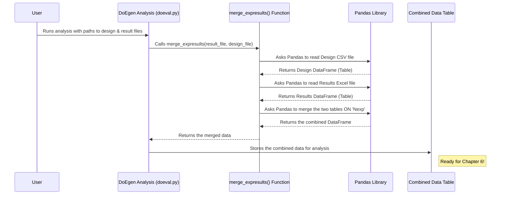

# Chapter 5: Experiment Result Input & Merging

In [Chapter 4: Design Selection](04_design_selection_.md), we saw how `DoEgen` helps us choose the best experimental plan (like the `Designtable_optimal_Nrun72.csv` file) based on efficiency metrics. Now comes the exciting part: you've actually *run* those experiments! Maybe you baked the cakes, grew the plants, or ran the simulations according to the plan.

Now you have the results – how tasty was each cake? How tall did each plant grow? What was the output of each simulation? This chapter is all about taking those real-world results and getting them ready to be analyzed by `DoEgen`.

## The Goal: Matching Results to the Plan

Imagine you followed the test drive schedule from Chapter 4. For each drive (each row in your `Designtable_...csv`), you recorded the actual fuel efficiency (Miles Per Gallon or Liters per 100km).

Now you have two pieces of information:
1.  **The Plan:** Which car settings (engine, transmission, etc.) were used for each specific test drive (e.g., Drive #1, Drive #2...). This is in your `Designtable_...csv` file.
2.  **The Results:** The actual fuel efficiency you measured for each test drive (e.g., Drive #1 got 25 MPG, Drive #2 got 30 MPG...). This might be scribbled in a notebook or typed somewhere else.

The goal of **Experiment Result Input & Merging** is to **combine these two pieces of information systematically**. We need to match the result (e.g., 25 MPG) back to the exact conditions that produced it (Drive #1: specific engine, transmission, etc.).

`DoEgen` needs this combined information to figure out how the different factors (engine, transmission) influenced the outcome (fuel efficiency).

## The Tool: The Experiment Results Excel Template

Just like we used an Excel template to define our experiment setup in [Chapter 1: Experiment Setup Definition
](01_experiment_setup_definition_.md), `DoEgen` uses another Excel template to collect your experimental results. This ensures the results are in a structured format that `DoEgen` can easily understand and merge with the original design.

You can create a blank template file using a helper script included with `DoEgen`:

```bash
# Run this command in your terminal in the DoEgen project directory
python -m doegen.create_resultfile
```

This command creates an Excel file named `Experiment_results_template.xlsx`.

Let's look at the key columns in this template:

*(Based on the image from `MANUAL.md`)*
{width=600}

| Column Header | Description                                                                                                                                                              | Example Value   | Why it's Important                                     |
| :------------ | :----------------------------------------------------------------------------------------------------------------------------------------------------------------------- | :-------------- | :----------------------------------------------------- |
| `Nexp`        | **Experiment Run Number.** This *must* match the `Nexp` number from your `Designtable_....csv` file.                                                                       | `1`, `2`, ...   | **Crucial!** This is how results are linked to factors. |
| `PID`         | **Point ID (Optional).** Use this if you measure results at multiple locations or times *within* the same experiment run (e.g., different sensors, different time points). | `SensorA`, `1`  | Allows for more detailed, repeated measures analysis.  |
| `Y Label`     | **Result Name (Optional).** Use this if you measure multiple *different types* of results for each run (e.g., 'Taste Score' and 'Baking Time' for the cake).             | `Taste`, `MPG`  | Allows analysis of multiple outcome variables.         |
| `Y Exp`       | **The Actual Measured Result.** This is the outcome value you observed for the specific run (`Nexp`), point (`PID`), and result type (`Y Label`).                         | `8.5`, `25.3`   | **The core data!** This is what you measured.        |
| `Y Truth`     | **True/Target Value (Optional).** If you know the 'correct' or expected value (e.g., in simulations or calibration), enter it here.                                   | `9.0`, `26.0`   | Used for calculating accuracy (like RMSE) in analysis. |
| `Std Y Exp`   | Standard Deviation of `Y Exp` (Optional).                                                                                                                                | `0.2`           | For advanced analysis considering measurement noise.   |
| `Std Y Truth` | Standard Deviation of `Y Truth` (Optional).                                                                                                                              | `0.1`           | For advanced analysis.                                 |
| `Weight PID`  | Weight for this specific point (Optional).                                                                                                                               | `1.0`           | For advanced weighted analysis.                        |

**The most important columns for basic use are `Nexp` and `Y Exp`.**

## Filling Out the Results Template

Let's say you used the `Designtable_optimal_Nrun72.csv` from Chapter 4 for your experiment. It had 72 runs (`Nexp` from 1 to 72). You measured one result, let's call it 'Yield'. You only measured it once per run (so `PID` and `Y Label` can be simple, like `1`).

Here’s how you might start filling out `Experiment_results_template.xlsx`:

| Nexp | PID | Y Label | Y Exp | Y Truth | Std Y Exp | Std Y Truth | Weight PID |
| :--- | :-: | :------ | :---- | :------ | :-------- | :---------- | :--------- |
| 1    | 1   | Yield   | 85.2  |         |           |             |            |
| 2    | 1   | Yield   | 91.5  |         |           |             |            |
| 3    | 1   | Yield   | 88.0  |         |           |             |            |
| ...  | ... | ...     | ...   | ...     | ...       | ...         | ...        |
| 72   | 1   | Yield   | 93.1  |         |           |             |            |

*You would fill in the actual `Y Exp` value you measured for each of the 72 runs.* If you had multiple PIDs or Y Labels, you would have more rows. For example, if run `Nexp=1` had `PID=SensorA` and `PID=SensorB`, you'd have two rows for `Nexp=1`.

**Key Point:** The `Nexp` column in your results file is the bridge connecting your measured `Y Exp` back to the specific factor settings used in that run, which are listed in the corresponding `Nexp` row of your `Designtable_....csv` file.

## How `DoEgen` Merges the Data (Internal View)

You don't usually run a separate command just for merging. The merging happens *inside* the next step: the result analysis module ([Chapter 6: Result Analysis & Statistics
](06_result_analysis___statistics_.md)). When you run the analysis script (`doegen.doeval`), one of the first things it does is read both your design table and your results file and combine them.

**Step-by-step merging process:**

1.  **Read Design:** The analysis module reads the selected design table (e.g., `Designtable_optimal_Nrun72.csv`) which contains the factor settings for each `Nexp`.
2.  **Read Results:** It reads your filled-in results file (e.g., `Experiment_results_Nrun72.xlsx`).
3.  **Match 'Nexp':** It uses the `Nexp` column as the key to link the two tables. For each row in the results file, it finds the row in the design table with the *same* `Nexp`.
4.  **Combine:** It creates a new, combined table that includes both the factor settings (from the design table) and the measured results (from the results file) for each experiment run.

**Sequence Diagram:**



This diagram shows that the `doeval.py` script uses a helper function (`merge_expresults`), which in turn uses the powerful `pandas` library to read the files and perform the merge based on the `Nexp` column.

## Diving Deeper into the Code (Simplified View)

The function responsible for this merging is typically `merge_expresults` inside the `doegen/doeval.py` script. Let's look at a simplified version:

```python
# Simplified view from doegen/doeval.py - merge_expresults function
import pandas as pd

def merge_expresults(fname_result, fname_design, y_label=None):
    """
    Reads experiment results and merges with the design parameter file.

    Args:
        fname_result (str): Path to the experimental results file (Excel).
        fname_design (str): Path to the experimental design file (CSV or Excel).
        y_label (str, optional): Filter results for a specific Y Label. Defaults to None.

    Returns:
        pandas.DataFrame: A combined table with factors and results.
    """
    try:
        # Read the results file (Excel)
        print(f"Reading results file: {fname_result}")
        dfres = pd.read_excel(fname_result)

        # Read the design file (Can be CSV or Excel)
        print(f"Reading design file: {fname_design}")
        if fname_design.endswith('.csv'):
            dfdes = pd.read_csv(fname_design)
        else:
            dfdes = pd.read_excel(fname_design)

        # Optional: Filter results for a specific 'Y Label' if provided
        if y_label is not None:
            print(f"Filtering results for Y Label: {y_label}")
            dfres = dfres[dfres["Y Label"] == y_label]

        # --- The Core Merging Step ---
        # Use pandas merge function. It looks for common columns ('Nexp' here).
        # 'how="left"' means keep all rows from the results (left) table
        # and add matching data from the design (right) table.
        print(f"Merging results and design based on 'Nexp' column...")
        dfcomb = dfres.merge(dfdes, on="Nexp", how="left")

        print(f"Successfully merged data. Combined table has {dfcomb.shape[0]} rows and {dfcomb.shape[1]} columns.")
        return dfcomb

    except FileNotFoundError as e:
        print(f"Error: File not found - {e}")
        return None
    except Exception as e:
        print(f"Error during merging: {e}")
        return None

# How it might be called inside doeval.py (simplified):
# design_file = "output/Designtable_optimal_Nrun72.csv"
# results_file = "data/Experiment_results_Nrun72.xlsx"
# combined_data = merge_expresults(results_file, design_file)
# if combined_data is not None:
#    # Proceed with analysis using combined_data... (Chapter 6)
#    pass
```

This code snippet shows the key steps:
1.  It uses `pandas.read_excel` and `pandas.read_csv` to load your data into tables (called DataFrames).
2.  It optionally filters the results based on the `Y Label`.
3.  The magic happens with `dfres.merge(dfdes, on="Nexp", how="left")`. This tells pandas: "Take the results table (`dfres`), find the matching `Nexp` row in the design table (`dfdes`), and combine the columns into a single new table."
4.  It returns this combined table, ready for the statistical analysis in the next chapter.

## Conclusion

In this chapter, we focused on the crucial step of preparing your experimental results for `DoEgen`. We learned about the **Experiment Results Excel template** and the importance of structuring your data, especially using the `Nexp` column to link results back to the specific experimental conditions (factors and levels) from your chosen design table.

We saw that while you manually fill in the results template, the actual **merging** of results with the design plan happens automatically as the first step within the analysis module (`doeval.py`), using the `pandas` library.

Now that we have a single, combined table containing both the experimental plan *and* the measured outcomes, we are perfectly set up to finally analyze the data and understand the impact of our factors.

Let's proceed to [Chapter 6: Result Analysis & Statistics
](06_result_analysis___statistics_.md) to learn how `DoEgen` helps us make sense of these combined results!

---

Generated by [AI Codebase Knowledge Builder](https://github.com/The-Pocket/Tutorial-Codebase-Knowledge)