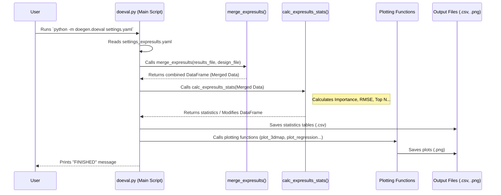

# Chapter 6: Result Analysis & Statistics

Welcome back! In [Chapter 5: Experiment Result Input & Merging
](05_experiment_result_input___merging_.md), we successfully combined our experimental plan (the factor settings) with the actual results we measured (`Y Exp` values). We now have a single, rich dataset ready for interrogation!

But just having the data isn't enough. We need to make sense of it. Which factors actually *mattered*? Which settings led to the best outcomes? This chapter introduces **Result Analysis & Statistics**, the part of `DoEgen` that helps you answer these critical questions.

## What's the Big Idea? Finding the Story in Your Data

Imagine you completed all the test drives from our car fuel economy example (Chapter 5). You diligently recorded the MPG for each car configuration you tested. Now, you have a spreadsheet full of numbers. What next?

You'd want to analyze this data to find the story:
*   **Performance Check:** How good were the results overall? If you knew the "official" MPG ratings (`Y Truth`), how close were your measurements? (This is like calculating accuracy).
*   **Key Influencers:** Did changing the `Engine Type` have a huge impact on MPG? What about `Tire Pressure`? Or was `Paint Color` irrelevant? (This is finding factor importance).
*   **Top Performers:** Which specific combination of `Engine Type`, `Tire Pressure`, etc., gave the absolute best fuel economy in your tests? (This is identifying the best settings).

**Result Analysis & Statistics** in `DoEgen` does precisely this kind of analysis automatically. It processes your combined data to extract meaningful insights, helping you understand *what* happened in your experiment and *why*.

## Key Analysis Tasks `DoEgen` Performs

`DoEgen`'s analysis module (`doeval.py`) focuses on several key tasks:

1.  **Calculating RMSE (if `Y Truth` is available):**
    *   **What it is:** Root Mean Square Error (RMSE) measures the average difference between your experimental results (`Y Exp`) and the known true values (`Y Truth`).
    *   **Analogy:** If the car manufacturer stated a car gets 30 MPG (`Y Truth`), and your test drive measured 28 MPG (`Y Exp`), the error is 2 MPG. RMSE calculates an overall "average error" across all your tests.
    *   **Why it matters:** A lower RMSE indicates your experimental results were closer to the true values, suggesting higher accuracy or a better model fit (in simulations).

2.  **Determining Factor "Importance":**
    *   **What it is:** This identifies how much influence each factor has on the outcome (`Y Exp`). It calculates the *range* of the average outcome when changing a factor's levels.
    *   **Analogy:** If the average MPG for 'Electric' engines was 50 and for 'Petrol' engines was 25, the range (importance) for `Engine Type` is 50 - 25 = 25 MPG (a big impact!). If the average MPG for 'Red' paint was 30.1 and 'Blue' paint was 30.0, the range for `Paint Color` is only 0.1 MPG (very low importance).
    *   **Why it matters:** Helps you focus on the factors that actually drive the results and ignore the ones that don't make much difference.

3.  **Identifying Top Performers:**
    *   **What it is:** If you provided `Y Truth`, `DoEgen` ranks the experiments based on the lowest RMSE (most accurate runs). It lists the factor settings for these top-performing runs.
    *   **Analogy:** Listing the top 5 car configurations from your test drives that had the smallest difference between your measured MPG and the official MPG rating.
    *   **Why it matters:** Helps you pinpoint the specific settings that achieved the best (or most accurate) results in your experiment.

4.  **Correlation Analysis:**
    *   **What it is:** Examines the relationship between each factor and the outcome (Y). Does increasing Factor X tend to increase Y? Decrease Y? Or have no clear relationship?
    *   **Analogy:** Does higher `Tire Pressure` generally lead to higher `MPG`?
    *   **Why it matters:** Gives insights into the direction and strength of the relationship between inputs and outputs.

## How to Run the Analysis

Running the result analysis is straightforward. You'll need:

1.  Your **Design Table** file (e.g., `Designtable_optimal_Nrun72.csv` from [Chapter 4: Design Selection
    ](04_design_selection_.md)).
2.  Your filled-in **Experiment Results** file (e.g., `Experiment_results_Nrun72.xlsx` from [Chapter 5: Experiment Result Input & Merging
    ](05_experiment_result_input___merging_.md)).
3.  A **Settings file** for the analysis (usually `settings_expresults.yaml`). This file tells `DoEgen` where to find your input files and where to save the analysis outputs. You can create default templates using `python -m doegen.init_config` if needed.

Once these are ready, you run the `doeval` module from your terminal:

```bash
# Make sure your design and result files are ready
# Make sure your settings file (e.g., settings_expresults.yaml) points to them

# Run the result evaluation module
python -m doegen.doeval settings_expresults.yaml
```

**What does this command do?**
*   It tells Python to run the `doeval` module within the `doegen` package.
*   It passes the `settings_expresults.yaml` file, which contains the necessary file paths and analysis options.

**What happens next?**
`DoEgen` will:
1.  Read the settings file.
2.  Read your design table and results file.
3.  **Merge** the two tables based on the `Nexp` column (as discussed in Chapter 5).
4.  Perform the statistical analyses (RMSE, Importance, Correlations, Top Performers) on the merged data.
5.  Save the results as tables (`.csv` files) and plots (`.png` files) in the output directory specified in your settings file.

## Understanding the Analysis Outputs

After running `doeval`, look inside your specified output folder (e.g., `test/expresults/` in the example). You'll find several helpful files for each 'Y Label' you analyzed:

*   **Factor Importance:**
    *   `Experiment_[Y_Label]_Factorimportance.csv`: A table listing each factor and its calculated importance (Yrange), along with the min, max, mean, and standard deviation of the average Y value across its levels.
    *   `Ybarplot_[Y_Label].png`: A bar chart visually showing the importance (range) of each factor. Factors with longer bars have a bigger impact.
      {width=600}

*   **RMSE and Top Performers (if `Y Truth` was provided):**
    *   `Experiment_[Y_Label]_RMSE.csv`: The combined data table with an added 'RMSE' column showing the calculated error for each experiment run.
    *   `Experiment_[Y_Label]_RMSE_TopN_sorted.csv`: A table showing the factor settings for the top N experiments that had the *lowest* RMSE (i.e., the most accurate runs).
      {width=600}
    *   `BestFactor_Avg[Y_Label].png`: A bar chart showing the average factor settings for the top N experiments, weighted by their RMSE. This gives an idea of the optimal settings based on accuracy.
      {width=600}

*   **Correlation Plots:**
    *   `Expresult_correlation_X-Y_[Y_Label].png`: Shows scatter plots of the outcome (Y Exp Mean) versus each *numeric* factor, with a regression line showing the trend. Helps visualize linear relationships.
      {width=600}
    *   `Y-pairwise-correlation_[Y_Label].png`: A "corner plot" showing heatmaps for every pair of factors. The color indicates the average outcome (Y Exp Mean) for that combination of factor levels. Useful for seeing interactions and how combinations affect the result.
      {width=600}
    *   (Similar plots for RMSE vs. factors are also generated if `Y Truth` is available).

These outputs provide a comprehensive overview of your experiment's results.

## What's Happening Under the Hood?

Let's look at the main steps `doeval.py` takes when you run the analysis command:

1.  **Read Settings:** Loads the paths and options from your `settings_expresults.yaml` file.
2.  **Merge Data:** Calls the `merge_expresults` function (from `doegen/doeval.py`, discussed in Chapter 5) to read the design (`.csv`) and results (`.xlsx`) files and combine them into a single pandas DataFrame based on the `Nexp` column.
3.  **Calculate Statistics (`calc_expresults_stats`):** This is the core analysis function (in `doegen/doeval.py`). It iterates through each `Y Label` (if you have multiple outcomes):
    *   Calculates average `Y Exp` and `Y Truth` (if available) for each `Nexp` (handling multiple PIDs if present).
    *   **Factor Importance:** For each factor, it groups the data by the factor's levels, calculates the average `Y Exp` for each level, and finds the range (max avg - min avg).
    *   **RMSE:** If `Y Truth` is present, calculates the RMSE for each `Nexp`.
    *   **Top Performers:** Sorts the results by RMSE and identifies the top N runs. Calculates weighted averages of factor settings for these top runs.
    *   Saves the calculated statistics to `.csv` files.
4.  **Generate Plots:** Calls various plotting functions (like `plot_3dmap`, `plot_regression`, also in `doegen/doeval.py`) using the calculated statistics and the merged data to create the `.png` visualizations.

**Sequence Diagram:**



## Diving Deeper into the Code (Simplified View)

The main logic resides in `doegen/doeval.py`.

1.  **Main Execution (`main` function):** Orchestrates the process.

   ```python
   # Simplified view from doegen/doeval.py - main function

   import pandas as pd
   import yaml
   from pathlib import Path # For handling file paths

   # Import helper functions from the same file
   from .doeval import merge_expresults, calc_expresults_stats, plot_3dmap, plot_regression # ... other plotting functions

   def main(inpath, fname_results, fname_design, outpath=None):
       # --- Setup Paths ---
       inpath = Path(inpath)
       if outpath is None:
           outpath = inpath
       else:
           outpath = Path(outpath)
       outpath.mkdir(parents=True, exist_ok=True) # Create output folder if needed

       # --- 1. Read Design and Results ---
       # (Uses pandas internally as shown in Chapter 5)
       print("Reading and merging design and result files...")
       dfcomb = merge_expresults(inpath / fname_results, inpath / fname_design)
       if dfcomb is None:
           print("Error during file reading/merging. Exiting.")
           return # Stop if merging failed

       # Get design table separately for stats calculation logic
       if str(fname_design).endswith('.csv'):
            dfdes = pd.read_csv(inpath / fname_design)
       else:
            dfdes = pd.read_excel(inpath / fname_design)
       # Filter out constant factors if any
       dfdes = dfdes[dfdes.columns[dfdes.nunique() > 1]].copy()
       params = list(dfdes)[1:] # Get factor names

       # Get the unique result types (Y Labels)
       try:
           ylabels = dfcomb["Y Label"].unique()
       except KeyError: # Handle case where 'Y Label' column might be missing
           print("Warning: 'Y Label' column not found. Assuming a single result type 'Y1'.")
           dfcomb["Y Label"] = 'Y1'
           ylabels = dfcomb["Y Label"].unique()

       # --- 2. Calculate Statistics ---
       print("Calculating statistics (Importance, RMSE, Top Performers)...")
       # Pass the original results DataFrame (dfcomb) and design DataFrame (dfdes)
       calc_expresults_stats(ylabels, dfdes, dfcomb, outpath)
       # This function saves its own CSV outputs internally

       # --- 3. Generate Plots ---
       print("Generating plots...")
       for ylabel in ylabels:
           print(f"  Plotting for Y Label: {ylabel}")
           # Reload the RMSE results saved by calc_expresults_stats
           try:
               df_results_for_ylabel = pd.read_csv(outpath / f"Experiment_{ylabel}_RMSE.csv")
           except FileNotFoundError:
               print(f"Warning: RMSE file for {ylabel} not found, skipping some plots.")
               continue # Skip to next ylabel if file doesn't exist

           # Call plotting functions
           plot_3dmap(df_results_for_ylabel, params, "Y Exp Mean",
                      outpath / f"Y-pairwise-correlation_{ylabel}.png")
           plot_regression(df_results_for_ylabel, params, 'Y Exp Mean',
                           outpath / f"Expresult_correlation_X-Y_{ylabel}.png")

           # Plot RMSE-related plots only if RMSE column exists
           if 'RMSE' in df_results_for_ylabel.columns:
                plot_3dmap(df_results_for_ylabel, params, "RMSE",
                           outpath / f"RMSE-pairwise-correlation_{ylabel}.png")
                # plot_factordis(df_results_for_ylabel, params, 'RMSE', # Example of another plot
                #               outpath / f"Expresult_distribution_X-RMSE_{ylabel}.png")

       print("FINISHED Result Analysis")

   # The script uses argparse to read the settings file path from the command line
   # and then calls main(**cfg) where cfg is the dictionary loaded from YAML
   ```

2.  **Core Statistics (`calc_expresults_stats`):** This function does the heavy lifting.

   ```python
   # Simplified logic inside doegen/doeval.py - calc_expresults_stats function

   import numpy as np
   import pandas as pd
   import matplotlib.pyplot as plt # Used for the importance bar plot

   def calc_expresults_stats(ylabels, dfdes, dfres, outpath):
       params = list(dfdes)[1:] # Factor names
       npar = len(params)
       nexp = dfdes.shape[0]

       for ylabel in ylabels:
           print(f"-- Analyzing Y Label: {ylabel} --")
           # --- Prepare Data for this Y Label ---
           ydf = dfres[dfres["Y Label"] == ylabel].copy() # Filter results for this Y
           # Calculate mean Y values per experiment run (Nexp)
           ymean = ydf.groupby("Nexp")["Y Exp"].mean()
           ystd = ydf.groupby("Nexp")["Y Exp"].std()
           # Add these means to a copy of the design DataFrame
           dfdes_y = dfdes.copy()
           dfdes_y["Y Exp Mean"] = ymean
           dfdes_y["Y Exp Std"] = ystd

           # --- Calculate Factor Importance ---
           factor_importance = []
           for i, param in enumerate(params):
               levels = dfdes_y[param].unique()
               avg_y_per_level = []
               for level in levels:
                   # Get average Y for runs where factor 'param' was at 'level'
                   avg_y = dfdes_y.loc[dfdes_y[param] == level, "Y Exp Mean"].mean()
                   avg_y_per_level.append(avg_y)
               # Importance = Range of average Y values across levels
               yrange = np.nanmax(avg_y_per_level) - np.nanmin(avg_y_per_level)
               factor_importance.append({
                   'Factor': param, 'Yrange': yrange,
                   'Ymin': np.nanmin(avg_y_per_level), 'Ymax': np.nanmax(avg_y_per_level),
                   'Ymean': np.nanmean(avg_y_per_level), 'Ystd': np.nanstd(avg_y_per_level)
               })
           # Save importance results
           df_importance = pd.DataFrame(factor_importance).set_index('Factor')
           df_importance.to_csv(outpath / f"Experiment_{ylabel}_Factorimportance.csv")
           # Plot importance bar chart (simplified call)
           df_importance.sort_values('Yrange')['Yrange'].plot(kind='barh', title=f'Importance (Range) {ylabel}')
           plt.tight_layout()
           plt.savefig(outpath / f"Ybarplot_{ylabel}.png")
           plt.close()

           # --- Calculate RMSE (if Y Truth exists) ---
           if "Y Truth" in ydf.columns and ydf["Y Truth"].notnull().any():
               print("  Calculating RMSE...")
               ytruemean = ydf.groupby("Nexp")["Y Truth"].mean()
               dfdes_y["Y Truth Mean"] = ytruemean
               # Calculate squared error for each Nexp
               sq_error = (dfdes_y["Y Exp Mean"] - dfdes_y["Y Truth Mean"])**2
               # Need to handle potential multiple PIDs per Nexp correctly for RMSE
               # (Actual code might need more careful averaging of squared errors before sqrt)
               # Simplified: Assume one value per Nexp for RMSE calculation here
               rmse = np.sqrt(sq_error) # Simplified: Should average before sqrt if multiple PIDs
               dfdes_y["RMSE"] = rmse
               # Save combined table with RMSE
               dfdes_y.to_csv(outpath / f"Experiment_{ylabel}_RMSE.csv", index=False)

               # --- Identify Top Performers ---
               print("  Identifying Top Performers by RMSE...")
               nsel = min(10, max(3, nexp // 5)) # Select top ~20%, between 3 and 10
               dfsort = dfdes_y.sort_values("RMSE").head(nsel)
               dfsort.to_csv(outpath / f"Experiment_{ylabel}_RMSE_Top{nsel}_sorted.csv", index=False)

               # (Actual code also calculates weighted average parameters for top performers
               # and plots them using helper functions like weighted_avg_and_std and plot_table)
           else:
               print("  'Y Truth' not found or empty, skipping RMSE calculations.")
               # Save the table without RMSE if Y Truth was missing
               dfdes_y.to_csv(outpath / f"Experiment_{ylabel}_results_summary.csv", index=False)
   ```

These snippets illustrate how `DoEgen` loads data, iterates through factors and outcomes, performs calculations using `pandas` and `numpy`, and generates outputs.

## Conclusion

In this chapter, we dove into **Result Analysis & Statistics**. We learned how `DoEgen` takes the merged experiment plan and results data (from Chapter 5) and processes it to uncover valuable insights.

We saw how to run the `doeval.py` script and what key analyses it performs: calculating accuracy (RMSE if `Y Truth` is available), determining which factors had the biggest impact (Factor Importance), identifying the best-performing settings, and examining correlations. We also explored the various `.csv` tables and `.png` plots generated, which provide a comprehensive summary of your experiment's findings.

With this analysis complete, you have a much clearer picture of how your factors influence your outcomes. The plots generated provide powerful visual summaries.

Now, let's take a closer look at these visualizations in the next chapter. We'll explore how to interpret the different plots `DoEgen` creates in more detail in [Chapter 7: Result Visualization
](07_result_visualization_.md).

---

Generated by [AI Codebase Knowledge Builder](https://github.com/The-Pocket/Tutorial-Codebase-Knowledge)