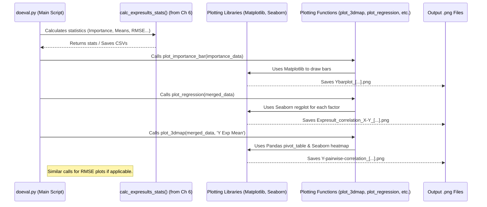

# Chapter 7: Result Visualization

In the previous chapter, [Chapter 6: Result Analysis & Statistics](06_result_analysis___statistics_.md), we learned how `DoEgen` analyzes the combined experiment plan and results data. It calculated important statistics like factor importance and RMSE, and identified top-performing experiments. This gave us valuable tables full of numbers.

But sometimes, just looking at tables of numbers can be overwhelming. It's often much easier to understand patterns and trends by looking at pictures! This is where **Result Visualization** comes in.

## Why Pictures? Making Sense of Results Visually

Imagine you just finished your car test drives (from our ongoing example). You have a spreadsheet showing the MPG for every combination of engine, tires, and driving style you tested. You also have the analysis results from Chapter 6, telling you which factors were most "important".

Now, how do you easily *see* these findings?
*   How much *more* important was `Engine Type` compared to `Tire Pressure`? A bar chart makes this comparison instant.
*   Does higher `Tire Pressure` *always* lead to better MPG, or does it level off? A scatter plot with a trend line reveals the relationship.
*   Does the best `Engine Type` change if you also use `Sporty Tires`? A heatmap showing combinations helps spot these interactions.

**Result Visualization** in `DoEgen` automatically creates these kinds of **charts and graphs** from your analysis results. It turns the numbers and tables from Chapter 6 into visual summaries, making it much faster and easier to grasp the key takeaways from your experiment.

## The Main Visual Tools `DoEgen` Provides

`DoEgen` generates several types of plots automatically when you run the analysis step ([Chapter 6: Result Analysis & Statistics](06_result_analysis___statistics_.md)). Let's look at the most common ones:

1.  **Factor Importance Bar Chart (`Ybarplot_[Y_Label].png`)**
    *   **What it shows:** Compares how much influence each factor had on the outcome (`Y Exp`). Longer bars mean the factor caused a bigger change in the results when its levels were varied.
    *   **Why it's useful:** Quickly identifies the most impactful factors ("big hitters") and the least impactful ones. Helps you focus on what really matters.

2.  **Factor vs. Outcome Correlation Plot (`Expresult_correlation_X-Y_[Y_Label].png`)**
    *   **What it shows:** For each *numeric* factor, it plots the factor's value against the average outcome (`Y Exp Mean`). It also draws a line showing the general trend (linear regression).
    *   **Why it's useful:** Helps understand the *direction* and *linearity* of the relationship. Does increasing the factor generally increase or decrease the outcome? Is the relationship roughly a straight line?

3.  **Pairwise Factor Heatmap (`Y-pairwise-correlation_[Y_Label].png`)**
    *   **What it shows:** A grid ("corner plot") where each square shows the interaction between *two* factors. The color in the square represents the average outcome (`Y Exp Mean`) when those two factors were set to specific levels.
    *   **Why it's useful:** Excellent for spotting *interactions*. Does the effect of Factor A change depending on the level of Factor B? You can see which combinations lead to high or low outcomes. It works for both numeric and categorical factors.

4.  **Top Performers Average Settings (`BestFactor_Avg[Y_Label].png`)** *(Only if `Y Truth` was provided)*
    *   **What it shows:** If you calculated RMSE (accuracy), this plot shows the average settings of the factors for the most accurate (lowest RMSE) experiments.
    *   **Why it's useful:** Gives a visual clue about the combination of settings that led to the most accurate results in your specific experiment.

## How are the Plots Generated?

You don't need to run a separate command! These plots are created automatically as part of the [Result Analysis & Statistics](06_result_analysis___statistics_.md) process. When you run:

```bash
python -m doegen.doeval settings_expresults.yaml
```

After calculating the statistics (like importance and correlations), `DoEgen` uses plotting libraries (`matplotlib` and `seaborn`) to generate these `.png` image files and saves them in your output directory (specified in `settings_expresults.yaml`), alongside the `.csv` tables from Chapter 6.

## Reading the Visual Story: Interpreting the Plots

Let's learn how to read the main plots using the examples from the `DoEgen` documentation.

**1. Factor Importance Bar Chart**

{width=600}

*   **How to read it:**
    *   The **Y-axis** lists your factors (parameters).
    *   The **X-axis** shows the "Importance" or "Range" of the outcome (Y). This is the difference between the average Y value at the factor's highest-impact level and its lowest-impact level.
    *   **Longer bars** mean the factor had a bigger impact on the outcome during your experiment. Shorter bars mean it had less impact.
*   **Example interpretation:** In this plot, `Parameter6` has the longest bar, meaning changing its levels caused the largest variation in the measured outcome (Y). `Parameter1` and `Parameter8` had relatively small impacts. This instantly tells you where to focus your attention if you want to control the outcome Y.

**2. Factor vs. Outcome Correlation Plot**

{width=600}

*   **How to read it:**
    *   This shows a grid of smaller plots, one for each *numeric* factor.
    *   In each small plot:
        *   The **X-axis** is the value of the factor.
        *   The **Y-axis** is the average outcome (`Y Exp Mean`).
        *   The **dots** represent the average outcome measured at different levels of that factor.
        *   The **blue line** shows the best straight-line fit through the dots (linear regression).
        *   The **shaded blue area** shows the uncertainty in that fit.
        *   The **`r` value** (top left) is the correlation coefficient. `r` close to 1 means strong positive linear correlation (line goes up), `r` close to -1 means strong negative linear correlation (line goes down), `r` close to 0 means weak or no linear correlation.
*   **Example interpretation:**
    *   For `Parameter1`, the line is almost flat and `r` is close to 0, suggesting little linear relationship with Y.
    *   For `Parameter3`, the line goes downwards and `r` is negative (around -0.5), suggesting that increasing `Parameter3` tends to decrease Y.
    *   For `Parameter7`, the line goes upwards steeply and `r` is strongly positive (around 0.9), indicating a strong positive linear relationship between `Parameter7` and Y.

**3. Pairwise Factor Heatmap (Corner Plot)**

{width=600}

*   **How to read it:**
    *   This is a grid showing interactions between pairs of factors.
    *   Look at a specific square, for example, the one in the second row, first column. The **X-axis** corresponds to `Parameter1`, and the **Y-axis** corresponds to `Parameter2`.
    *   The **colors** inside the square represent the average outcome (`Y Exp Mean`) observed for different combinations of `Parameter1` and `Parameter2` levels.
    *   The **colorbar** on the right tells you what outcome value each color corresponds to (e.g., blue might be low Y, red might be high Y).
*   **Example interpretation:** By looking at the colors in the grid for `Parameter1` vs `Parameter2`, you can see if certain combinations lead to particularly high (red) or low (blue) values of Y. If the color pattern changes drastically across the square, it suggests an *interaction* - the effect of `Parameter1` on Y depends on the level of `Parameter2`. If you see similar plots for RMSE (`RMSE-pairwise-correlation...`), you can see which combinations led to more or less accurate results.

## What's Happening Under the Hood? (Simplified)

Generating these plots involves using the results of the statistical analysis from Chapter 6.

**Simplified Flow:**



The `doeval.py` script first calculates the necessary data using `calc_expresults_stats`. Then, it calls specific plotting functions (like `plot_3dmap`, `plot_regression`) defined within `doeval.py`. These functions take the calculated data (often stored in pandas DataFrames) and use commands from the `matplotlib` and `seaborn` libraries to draw the actual plots and save them as `.png` files.

**Simplified Code Snippets (`doegen/doeval.py`):**

Let's look at tiny snippets to get the idea.

1.  **Factor Importance Bar Plot (inside `calc_expresults_stats`)**

    ```python
    # Simplified view from doegen/doeval.py - inside calc_expresults_stats

    import matplotlib.pyplot as plt
    import pandas as pd
    import numpy as np

    def calc_expresults_stats(ylabels, dfdes, dfres, outpath):
        params = list(dfdes)[1:] # Factor names
        npar = len(params)

        for ylabel in ylabels:
            # ... (calculate factor importance 'width' as shown in Ch 6) ...
            # df_importance = pd.DataFrame(...) # Contains 'Yrange' for each factor

            # --- Plotting Part ---
            plt.ioff() # Turn off interactive display
            plt.figure(figsize=(8, 5))
            # Sort factors by importance (range)
            df_sorted = df_importance.sort_values('Yrange')
            # Create horizontal bar plot
            plt.barh(
                df_sorted.index, # Factor names on Y-axis
                width=df_sorted['Yrange'], # Bar length based on importance
                # left=ymin_par[sort], # Optional: show min value start
                color="red",
            )
            plt.title(f"Factor Importance (Range) for {ylabel}")
            plt.xlabel("Change in Y (Range)")
            plt.tight_layout() # Adjust spacing
            # Save the plot
            plt.savefig(outpath / f"Ybarplot_{ylabel}.png", dpi=300)
            plt.close() # Close the plot figure
            # ... (rest of the stats calculation) ...
    ```
    *   This code uses `matplotlib.pyplot` (imported as `plt`) to create a horizontal bar chart (`plt.barh`) using the calculated importance range (`Yrange`). It saves the figure using `plt.savefig`.

2.  **Factor vs. Outcome Correlation Plot (`plot_regression`)**

    ```python
    # Simplified view from doegen/doeval.py - plot_regression function

    import matplotlib.pyplot as plt
    import seaborn as sns
    import pandas as pd
    import numpy as np

    def plot_regression(df, params, target_name, fname_out):
        """Creates Correlation plot."""
        # Select only numeric columns from the factor list
        numeric_params = df[params].select_dtypes(include=np.number).columns
        nfac = len(numeric_params)
        # Determine grid layout for subplots
        nax1 = int(np.sqrt(nfac))
        nax2 = int(np.ceil(nfac / nax1))

        plt.ioff()
        fig = plt.figure(figsize=(nax1 * 4, nax2 * 3)) # Adjust figure size
        fig.suptitle(f"Factor vs. {target_name} Correlation", y=1.02) # Add title

        for i, param_name in enumerate(numeric_params):
            # Create a subplot in the grid
            ax = fig.add_subplot(nax2, nax1, i + 1)
            # Use seaborn's regplot to create scatter + regression line
            sns.regplot(x=param_name, y=target_name, data=df, ax=ax,
                        scatter_kws={'s': 10}, # Smaller points
                        line_kws={'lw': 1}) # Thinner line
            # Calculate correlation coefficient
            r = df[param_name].corr(df[target_name])
            # Add correlation value text to the plot
            ax.annotate(f"r = {r:.2f}", xy=(0.05, 0.9), xycoords='axes fraction')
            ax.set_title(param_name) # Set title for subplot

        plt.tight_layout(rect=[0, 0, 1, 0.98]) # Adjust layout to prevent title overlap
        plt.savefig(fname_out, dpi=300)
        plt.close()
    ```
    *   This function uses the `seaborn` library (`sns.regplot`) which is built on top of `matplotlib`. `regplot` automatically creates the scatter plot and fits/draws the regression line for each numeric factor in a loop, placing each one in a subplot grid.

3.  **Pairwise Heatmap (`plot_3dmap`)**

    ```python
    # Simplified view from doegen/doeval.py - plot_3dmap function

    import matplotlib.pyplot as plt
    import seaborn as sns
    import pandas as pd
    import numpy as np

    def plot_3dmap(df, params, target_name, fname_out):
        """Plots pairwise heatmap (corner plot)."""
        nfac = len(params)
        # Find overall min/max of the target for consistent color scaling
        vmin = df[target_name].min()
        vmax = df[target_name].max()

        plt.ioff()
        fig, axs = plt.subplots(nfac - 1, nfac - 1, figsize=(nfac * 1.5, nfac * 1.5)) # Smaller figsize
        fig.suptitle(f"Pairwise Factor Heatmap for {target_name}", y=1.02)

        for i in range(nfac - 1): # Index for columns (X-axis factor)
            for j in range(i + 1, nfac): # Index for rows (Y-axis factor)
                ax = axs[j - 1, i] # Select the correct subplot
                try:
                    # Create a pivot table: average target value for each combination
                    pivot_data = pd.pivot_table(
                        df, values=target_name, index=[params[j]], columns=[params[i]],
                        aggfunc=np.nanmean # Use mean as the aggregation
                    )
                    # Draw the heatmap using seaborn
                    sns.heatmap(
                        pivot_data, cmap="viridis", # Use a different colormap
                        annot=False, ax=ax, # No annotations for cleaner look
                        vmin=vmin, vmax=vmax, # Consistent color scale
                        square=True, cbar=False # Make squares, no individual color bars
                    )
                except Exception as e:
                    # Handle cases where pivot might fail (e.g., insufficient data)
                    print(f"Could not create heatmap for {params[i]} vs {params[j]}: {e}")
                    sns.heatmap(pd.DataFrame(), ax=ax, cbar=False) # Draw empty plot

                # Clean up axes labels for inner plots
                ax.set_xlabel(params[i] if j == nfac -1 else "")
                ax.set_ylabel(params[j] if i == 0 else "")
                if i > 0: ax.set_yticklabels([])
                if j < nfac - 1: ax.set_xticklabels([])

        # Hide unused upper triangle plots
        for i in range(nfac - 1):
            for j in range(i):
                axs[j, i].set_visible(False)

        # Add a single color bar for the whole plot
        fig.colorbar(axs[1, 0].collections[0], ax=axs[:, -1], location='right', shrink=0.6)

        plt.tight_layout(rect=[0, 0, 0.9, 0.98]) # Adjust layout
        plt.savefig(fname_out, dpi=300)
        plt.close()

    ```
    *   This function iterates through pairs of factors. For each pair, it uses `pandas.pivot_table` to aggregate the `target_name` (e.g., `Y Exp Mean`) for each combination of levels. Then, it uses `seaborn.heatmap` to draw the colored grid representing these average values.

## Conclusion

In this chapter, we explored **Result Visualization**. We saw that `DoEgen` automatically generates various plots like bar charts, correlation plots, and heatmaps during the result analysis phase ([Chapter 6: Result Analysis & Statistics](06_result_analysis___statistics_.md)).

These visualizations are incredibly helpful because they turn complex tables of numbers into easy-to-understand pictures. We learned how to interpret the key plots to quickly grasp factor importance, understand relationships between factors and outcomes, and identify potential interactions. These visual insights are crucial for communicating your experimental findings effectively.

We've now walked through the main workflow of `DoEgen`, from defining the experiment to visualizing the results. Throughout this process, we've mentioned using configuration files (like `settings_design.yaml` and `settings_expresults.yaml`) to control `DoEgen`'s behavior. Let's wrap up by looking more closely at how these files work in the final chapter.

Next up: [Chapter 8: Configuration Handling](08_configuration_handling_.md).

---

Generated by [AI Codebase Knowledge Builder](https://github.com/The-Pocket/Tutorial-Codebase-Knowledge)