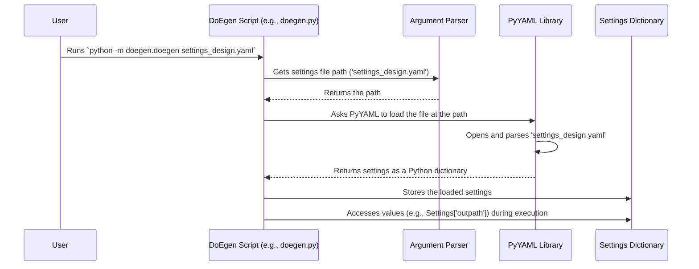

# Chapter 8: Configuration Handling

In [Chapter 7: Result Visualization](07_result_visualization_.md), we saw how `DoEgen` turns our analysis results into easy-to-understand plots. Throughout the previous chapters, we've hinted at using "settings files" (like `settings_design.yaml`) to tell `DoEgen` things like where our input files are located or where to save the output. This final chapter dives into how this **Configuration Handling** works.

## Why Do We Need Settings Files?

Imagine you have a TV. You wouldn't want to open up the back and rewire it every time you wanted to change the channel, adjust the volume, or switch the input source! Instead, you use a **remote control** or a **settings menu**.

**Configuration Handling** in `DoEgen` is exactly like that settings menu or remote control. It provides a way to tell `DoEgen` *how* to run without changing the core Python code itself. This is super important because:

*   **Flexibility:** You might want to run `DoEgen` on different experiments with different input files (`Experiment_setup.xlsx`) located in different folders.
*   **Customization:** You might want to change how long `DoEgen` spends searching for the best design (`maxtime_per_run`) or the maximum number of experiments (`nrun_max`) it should consider.
*   **Reusability:** You can easily reuse the same `DoEgen` code for various projects just by changing the settings file.

Instead of hard-coding file paths or run limits directly into the Python scripts (which would be like rewiring the TV!), `DoEgen` reads these settings from simple text files when it starts up.

## What is Configuration Handling in `DoEgen`?

Configuration Handling is the system `DoEgen` uses to manage all its operational settings. Think of it as the **central control panel** for the tool. It controls things like:

*   **Input Files:** Where is the `Experiment_setup.xlsx` file? Where is the `Experiment_results.xlsx` file?
*   **Output Location:** Where should `DoEgen` save the generated designs, efficiency reports, analysis results, and plots?
*   **Design Generation Parameters:** What's the minimum (`nrun_min`) and maximum (`nrun_max`) number of experiment runs to try generating? How big should the steps (`delta_nrun`) be between run sizes? How much time (`maxtime_per_run`) should be spent optimizing each run size?
*   **Analysis Options:** (Though less configurable in the current version, future versions might add options here).

## The Tool: Simple YAML Files

`DoEgen` uses a simple, human-readable file format called **YAML** (often pronounced "yam-ul") for its configuration files. YAML files typically end with the `.yaml` or `.yml` extension.

YAML is designed to be easy for both humans to read and write, and for computers to parse. It uses indentation (spaces) and key-value pairs separated by a colon (`:`).

Here's a tiny example of what YAML looks like:

```yaml
# This is a comment
project_name: My Cake Baking Experiment
output_directory: /path/to/my/results/
max_runs: 50
use_feature_x: true
```

This is much easier to understand than complex code!

## `DoEgen`'s Settings Files

`DoEgen` typically uses two main settings files:

1.  **`settings_design.yaml`:** Used when running the design generation step ([Chapter 2: Design Generation](02_design_generation_.md)).
2.  **`settings_expresults.yaml`:** Used when running the result analysis step ([Chapter 6: Result Analysis & Statistics](06_result_analysis___statistics_.md)).

You can create default template files using the command: `python -m doegen.init_config`

Let's look at simplified examples of what you might find in these files:

**Example: `settings_design.yaml` (Simplified)**

```yaml
# Settings for Design Generation (doegen.doegen)

# --- Input ---
# Path to the folder containing the setup file
path: 'test/input/'
# Name of the Excel setup file
fname_setup: 'Experiment_setup.xlsx'

# --- Output ---
# Path where all output folders and files will be saved
outpath: 'test/output/'

# --- Design Generation Parameters ---
# Maximum number of runs to generate a design for
nrun_max: 150
# Minimum number of runs to start generating from (can be None to let DoEgen calculate)
nrun_min: None
# Step size between run numbers (e.g., generate for 12, 18, 24... if delta=6)
delta_nrun: 6
# Maximum time (seconds) to spend optimizing for EACH run size
maxtime_per_run: 100
```

*   **Explanation:** This tells `DoEgen` where to find the `Experiment_setup.xlsx` file, where to save everything (`test/output/`), and the parameters controlling the search for designs (generate designs from a calculated minimum up to 150 runs, in steps of 6, spending up to 100 seconds on each size).

**Example: `settings_expresults.yaml` (Simplified)**

```yaml
# Settings for Result Analysis (doegen.doeval)

# --- Input ---
# Path containing the results and the specific design table used
inpath: 'test/output/'
# Name of the Excel results file you filled in
fname_results: 'Experiment_results_Nrun72.xlsx'
# Name of the specific design table CSV file you actually used for experiments
fname_design: 'Designtable_optimal_Nrun72.csv'

# --- Output ---
# Path where analysis results (tables, plots) will be saved
outpath: 'test/expresults/'
```

*   **Explanation:** This tells the analysis script (`doeval`) where to find the results file (`Experiment_results_Nrun72.xlsx`) and the corresponding design table (`Designtable_optimal_Nrun72.csv`). It also specifies that the analysis output should go into the `test/expresults/` folder.

## How `DoEgen` Uses the Settings

When you run a `DoEgen` command, you tell it which settings file to use:

```bash
# Running design generation
python -m doegen.doegen settings_design.yaml

# Running result analysis
python -m doegen.doeval settings_expresults.yaml
```

The script (`doegen.py` or `doeval.py`) starts by:
1.  Looking at the command-line argument (`settings_design.yaml` or `settings_expresults.yaml`).
2.  Opening and reading that specific YAML file.
3.  Loading the settings (like `outpath`, `nrun_max`, etc.) into memory.
4.  Using these loaded values throughout its execution to know where files are, how many runs to generate, etc.

## Creating and Editing Settings Files

*   **Templates:** `DoEgen` provides template YAML files (you can generate them with `python -m doegen.init_config` or find them in the installation).
*   **Editing:** You just need a simple text editor (like Notepad, VS Code, Sublime Text, etc.) to open the `.yaml` file and change the values after the colons (`:`) to match your file locations and desired parameters.
*   **Indentation:** Be careful with indentation (spaces at the beginning of lines) if you add more complex structures, as YAML uses it to understand the file structure. For simple key-value pairs like in the examples, indentation is usually not an issue.

## How It Works Under the Hood

`DoEgen` uses standard Python libraries to handle configuration files.

**High-Level Steps:**

1.  You run the script, providing the path to your `.yaml` settings file.
2.  The script uses Python's `argparse` library to get the settings file path from the command line.
3.  It uses the `PyYAML` library (or `yaml` for short) to open and read the YAML file.
4.  The `yaml` library parses the text, understanding the `key: value` pairs and the structure.
5.  It converts the YAML content into a Python data structure (usually a dictionary).
6.  The main `DoEgen` script can then easily access the settings by looking up keys in this dictionary (e.g., get the value associated with the key `outpath`).

**Sequence Diagram:**



**Code Snippet (Simplified from `configloader.py`):**

This is how `DoEgen` might load the settings file at the very beginning.

```python
# Simplified from doegen/configloader.py or doegen/doegen.py main_cli

import argparse # Library to handle command-line arguments
import yaml     # Library to read YAML files

def load_settings(default_path='settings_design.yaml'):
    """Loads settings from a YAML file specified on the command line."""

    # 1. Set up to read the file path from the command line
    parser = argparse.ArgumentParser()
    # Allow the user to specify a settings file path, or use the default
    parser.add_argument('settings_path', nargs='?', default=default_path)
    args = parser.parse_args() # Get the arguments provided by the user

    settings_file_path = args.settings_path
    print(f"Using settings from: {settings_file_path}")

    try:
        # 2. Open and read the YAML file
        with open(settings_file_path) as f:
            # Use yaml.safe_load to parse the file safely
            cfg = yaml.safe_load(f)

        # 3. Return the loaded settings (as a dictionary)
        print("Settings loaded successfully.")
        return cfg

    except FileNotFoundError:
        print(f"Error: Settings file not found at {settings_file_path}")
        return None
    except Exception as e:
        print(f"Error loading settings file: {e}")
        return None

# --- How the main script might use this ---
# settings = load_settings()
# if settings:
#    # Now access values like:
#    output_folder = settings['outpath']
#    max_runs = settings['nrun_max']
#    # ... use these values in the rest of the script ...
# else:
#    print("Could not load settings. Exiting.")
```

*   **Explanation:** This code snippet first uses `argparse` to figure out which settings file the user wants to load (getting the path from the command line). Then, it opens that file and uses `yaml.safe_load()` to read the content and convert it into a Python dictionary called `cfg`. The main script can then use this `cfg` dictionary to get the values for `outpath`, `nrun_max`, etc.

## Benefits of Using Configuration Files

*   **Easy Customization:** Change file paths, run limits, etc., without touching the code.
*   **Separation of Concerns:** Keeps the "what to do" (code logic) separate from the "how to do it specifically this time" (settings).
*   **Reproducibility:** Save your settings file along with your results to remember exactly how an analysis was run.
*   **Sharing:** Share settings files easily with collaborators.

## Conclusion

This chapter explored **Configuration Handling** in `DoEgen`. We learned that `DoEgen` uses simple, human-readable **YAML files** (like `settings_design.yaml` and `settings_expresults.yaml`) as its "settings panel" or "remote control". These files allow you to easily specify input/output paths, run limits, and other parameters without modifying the core Python code.

We saw examples of these files, how `DoEgen` reads them using the `PyYAML` library, and why this approach is beneficial for flexibility and reproducibility.

This concludes the main tutorial chapters for `DoEgen`! We've journeyed from defining an experiment ([Chapter 1: Experiment Setup Definition](01_experiment_setup_definition_.md)), generating and evaluating designs ([Chapter 2: Design Generation](02_design_generation_.md), [Chapter 3: Design Evaluation & Efficiency Metrics](03_design_evaluation___efficiency_metrics_.md)), selecting the best plan ([Chapter 4: Design Selection](04_design_selection_.md)), inputting results ([Chapter 5: Experiment Result Input & Merging](05_experiment_result_input___merging_.md)), analyzing the outcomes ([Chapter 6: Result Analysis & Statistics](06_result_analysis___statistics_.md)), visualizing the findings ([Chapter 7: Result Visualization](07_result_visualization_.md)), and finally, understanding how to configure the tool's operation ([Chapter 8: Configuration Handling](08_configuration_handling_.md)).

We hope this tutorial provides a solid foundation for using `DoEgen` to design and analyze your own experiments effectively. Happy experimenting!

---

Generated by [AI Codebase Knowledge Builder](https://github.com/The-Pocket/Tutorial-Codebase-Knowledge)