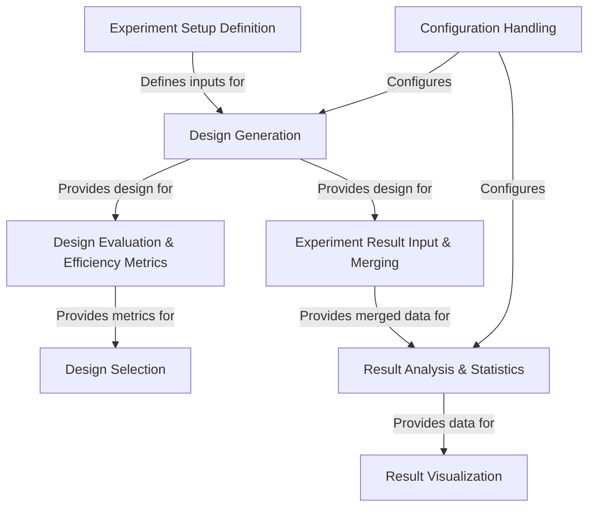

# Tutorial: DoEgen

`DoEgen` is a Python tool designed to help researchers with **Design of Experiments (DoE)**.
It *automates* the creation of efficient experimental plans (*design generation*), helps evaluate how *good* these plans are (*design evaluation*), and suggests the best plans to use (*design selection*).
After running the experiments, `DoEgen` can take the results, combine them with the plan, and perform *statistical analysis* and create *visualizations* to understand which factors are most important and what settings yield the best outcomes.
It uses simple Excel templates for defining experiments and inputting results, and YAML files for configuration.

**Source Repository:** [https://github.com/sebhaan/DoEgen](https://github.com/sebhaan/DoEgen)

## Chapters

1. [Experiment Setup Definition
](01_experiment_setup_definition_.md)
2. [Design Generation
](02_design_generation_.md)
3. [Design Evaluation & Efficiency Metrics
](03_design_evaluation___efficiency_metrics_.md)
4. [Design Selection
](04_design_selection_.md)
5. [Experiment Result Input & Merging
](05_experiment_result_input___merging_.md)
6. [Result Analysis & Statistics
](06_result_analysis___statistics_.md)
7. [Result Visualization
](07_result_visualization_.md)
8. [Configuration Handling
](08_configuration_handling_.md)

---

Generated by [AI Codebase Knowledge Builder](https://github.com/The-Pocket/Tutorial-Codebase-Knowledge)
